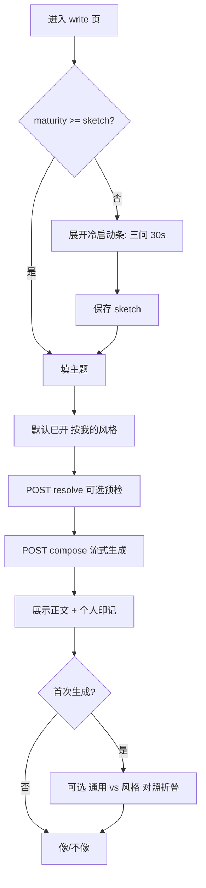

# 个人特色 IP 产品方案（v5.2）

> **导航与对象（v5.1）**  
> 1. 后台 **自动创建**「**我的 IP**」；2. **复制 IP** 新建；3. 知识库点击 → `/notes`，二级仅「个人特色 IP」。  
>
> **已定稿决策（v5.2）**  
> | # | 决策 |
> |---|------|
> | 1 | **无 Free/Pro 档位限制 IP**：与现网一致，**充值有余额即可用全部 IP 能力**（新建/复制/学习/风格写作按既有用量扣费）。 |
> | 2 |「**我的 IP**」**不可删除**，**可改名**；`isSystemSeed=true` 仅后端策略标记。 |
> | 3 | **复制默认带文章全文 + 经历全文**（深拷贝 note 至新绑定本）；用户可在复制弹窗取消勾选。 |
> | 4 | 老用户 `ensure-default` 后 **不做** 迁移/移入引导。 |
> | 5 | IP 素材删除进 **同一回收站** `/notes/trash`，**分 Tab**：「参考资料」\|「个人特色 IP」。 |

---

## 一、导航与信息架构

### 1.1 侧栏（对齐「创作」：父级直达 + 单一二级）

```text
知识库（点击）              → /notes           笔记本列表 / 工作台（现网能力，即「存外部资料」）
  └─ 个人特色 IP（二级）    → /notes/author-ip  IP 列表与管理

回收站（一级）              → /notes/trash      Tab：**参考资料** | **个人特色 IP**（同页分栏，见 §2.5）
```

| 交互 | 行为 |
|------|------|
| 点「知识库」 | 进入 `/notes`，父级高亮 |
| 点「个人特色 IP」 | 进入 `/notes/author-ip`，父级 + 二级均高亮 |
| 展开/收起 | 与「创作」一致：在 `/notes` 或 `/notes/author-ip` 下可展开显示二级 |

**不设「参考资料」子入口**：避免与父级 `/notes` 重复；教育文案改为「知识库内存资料；个人特色 IP 学你的写法」。

### 1.2 路由

| 路径 | 页面 |
|------|------|
| `/notes` | 笔记本 Hub（默认知识库落地页） |
| `/notes/author-ip` | IP 列表（含默认「我的 IP」） |
| `/notes/author-ip/new` | 空白新建向导 |
| `/notes/author-ip/new?copyFrom={ipId}` | **复制新建**（预填命名与选项） |
| `/notes/author-ip/[ipId]` | 单 IP 工作台 |

### 1.3 悬停说明（二级「个人特色 IP」）

> 输出你的经历和写作偏好，创建专属个人写作风格；创作时可勾选「按我的风格写作」，系统将自动匹配该 IP 的口吻与经历。

---

## 二、默认 IP「我的 IP」（后台自动创建）

### 2.1 触发时机（幂等 `ensureDefaultAuthorIp`）

满足 **任一** 即执行（仅无 IP 时创建）：

- 用户 **注册成功** 后；
- 首次调用 `GET /api/v1/author-ips`；
- 首次开启「按我的风格写作」且当前无 IP。

### 2.2 默认对象属性

| 字段 | 值 |
|------|-----|
| `name` | `我的 IP`（用户可改名） |
| `isDefault` | `true` |
| `isSystemSeed` | `true`（标记为系统种子，用于策略见 §待改善） |
| `maturity` | `empty` → 引导 `sketch` |
| 绑定笔记本 | 自动 `notebookKind=author_ip`，内部名如 `ip_{id}` |

### 2.3 产品行为

- IP 列表 **永不为空**（至少一张「我的 IP」卡）。  
- 空状态改为 **「完善我的 IP」**（三问 / 上传 / 访谈），而非「新建第一个」。  
- **额外新建**：空白向导 **或** 复制已有 IP。  
- 写作：**未选 IP 时始终回落到默认「我的 IP」**（仅 1 个时不展示下拉）。

### 2.4 「我的 IP」删除与改名（已定稿）

| 规则 | 说明 |
|------|------|
| **不可删除** | UI 无删除入口；API 拒绝删除 `isSystemSeed=true` 的 IP |
| **可改名** | 显示名、副标题、头像色均可改；内部 `notebook` 名可随 `ipId` 不变 |
| **默认** | 始终保留 `isDefault=true`，直至用户将 **另一 IP** 设为默认 |
| **其他 IP** | 可删除（软删 → 回收站「个人特色 IP」Tab）；删除前若其为默认须先改默认 |

### 2.5 回收站（已定稿）

路径仍为 `/notes/trash`，页内 **Tab**：

| Tab | 内容 |
|-----|------|
| **参考资料** | 现网逻辑：`notebookKind=reference` 或未绑 IP 的笔记 |
| **个人特色 IP** | `authorIpId` 非空的 IP 素材 note；展示所属 IP 名称 |

- 恢复 / 彻底删除与现网一致，按 Tab 过滤。  
- 删除 **整个 IP 实体**（非「我的 IP」）时：该 IP 下素材 **一并** 进入「个人特色 IP」Tab（或整 IP 归档策略见 §待改善 P2）。

### 2.6 计费与能力（已定稿，对齐现网）

- **不设** IP 数量套餐档（无 Free 仅 1 个 / Pro 3 个等）。  
- **有余额**（或等价可用额度）即可：空白新建、复制新建、学习、按风格写作等，按平台既有 **按次/按 Token/按分钟** 扣费。  
- 可选 **防滥用软上限**（如单用户 ≤50 IP）仅运维配置，**不对用户展示档位**（见 §待改善）。

---

## 三、复制 IP 新建

### 3.1 入口

- IP 列表卡片菜单 · **「复制并新建」**  
- IP 工作台设置 · **「以此 IP 为模板复制」**

### 3.2 复制范围（默认可取消勾选）

| 复制项 | 默认 | 说明 |
|--------|:----:|------|
| 名称 | ✅ | `原名称 + 副本`，向导可改 |
| 一句话定位 / 副标题 | ✅ | |
| 场景域 + displayName + trait + 预设 + taboos | ✅ | Profile 快照 |
| **经历卡全文** | ✅ | **深拷贝** note 至新绑定本，`authorIpId=新 IP` |
| **已发表/草稿文章全文** | ✅ | **深拷贝** note；复制 preprocess / `bookSummaryL0` 元数据 |
| embedding 质心 | ✅ | 随素材复制后 **异步刷新学习**（见下） |

**复制前确认（必显）**：说明将复制全部文章与经历正文；多客户/多账号场景请确认无串号；消耗余额与新建相当（若复制触发批量 preprocess/学习）。

### 3.3 流程

```text
选复制项（默认全选正文）→ 二次确认文案 → POST /author-ips/{sourceId}/duplicate
  → 新 AuthorIP + 新绑定本 + Profile 快照 + 批量克隆 notes
  → 队列：对新 IP 触发 preprocess 校验 / 可选 lite|full 学习
  → /notes/author-ip/[newId]?welcome=copy
  → 顶部：已复制 N 篇文章、M 条经历；[立即学习] [稍后再说]
```

**成熟度**：若复制了文章且 preprocess 就绪，可 **继承** 源 IP 的 `maturity`（如 `ready`），并标记 `clonedFromIpId`；建议仍提示 **「修改至少 1 篇以区分副本」** 再视为独立 IP（体验建议，非阻断）。

**老用户**：复制 **不替代** 迁移；ensure 后「我的 IP」仍为空，**不** 弹移入引导（已定稿）。

### 3.4 与空白新建

| 方式 | 适用 |
|------|------|
| **我的 IP**（已有） | 首次完善、主号 |
| **空白新建** | 全新人设 |
| **复制新建** | 多号矩阵、客户方案模板、同人设微调 |

---

## 四、核心对象（多 IP，默认已占 1 槽）

```text
用户
 ├─ /notes … 普通 notebooks（资料事实）
 └─ AuthorIP[]
       ├─ [系统种子] 我的 IP（默认）
       ├─ … 用户空白新建
       └─ … 用户复制新建
             各：1:1 笔记本 + AuthorProfile + 内场景域
```

- **AuthorProfile**、Resolver、印记、反馈、生命力、M3 站内图：**均按 `authorIpId` 隔离**。  
- 写作可选「引用知识库资料本」作 **事实 RAG**，不参与文风学习。

---

## 五、IP 列表页（`/notes/author-ip`）

- 顶栏：**空白新建** | **（卡片上）复制并新建**  
- 「我的 IP」带 **默认** 角标；排序默认置顶。  
- 卡片：名称、oneLiner、maturity、素材数、待学习、最近使用。  
- 卡片菜单：进入工作台 · 设为默认 · **复制并新建** · 删除（**「我的 IP」无删除项**）。  
- **首次进入本二级页**：轻量对比（知识库 = 资料；IP = 你的风格），可跳过。
- 卡片 **主按钮**：**写一篇**（直达 §六，最短成文路径）。

---

## 六、写一篇（M0 必做 · 最短成文路径）

> **定位**：建好 / 选中 IP 后 **产出发布级正文** 的主入口；优先于「去创作 → 社媒」的绕路路径。  
> **目标点击**：已完善 IP 的用户 **≤3 次**（进页 → 填主题 → 生成）；冷启动用户可在同页完成三问后 **不跳转 Tab** 即生成。

### 6.1 路由与入口

| 入口 | 路径 | 说明 |
|------|------|------|
| **主入口** | `/notes/author-ip/[ipId]/write` | IP 工作台内「写一篇」Tab 与同路径 |
| 概览 CTA | 同上 | 大按钮「写一篇」 |
| IP 列表卡片 | `/notes/author-ip/[ipId]/write` | 卡片主按钮「写一篇」 |
| 首次开风格（可选） | 无 IP 素材时重定向到 write + 内联三问 | 见 §6.4 |

侧栏：**个人特色 IP → [某 IP] → 写一篇**（工作台 Tab 顺序建议：**概览 | 写一篇 | 素材 | 我的特色 | 场景 | 设置**）。

### 6.2 默认体裁（减少表单项）

首版默认 **「通用文章」**（不绑定平台排版，段落 + 可选小标题，适合 800～2500 字）；用户可改选平台体裁。

| 体裁 chip | 内部 `contentType` | 说明 |
|-----------|-------------------|------|
| **通用文章**（默认） | `article` | 默认选中；记住用户上次选择 |
| 公众号图文 | `wechat_mp` | 强调公众号深度阅读结构 |
| 小红书笔记 | `xiaohongshu` | M0 可隐藏为「更多」折叠，M1 常显 |
| 短帖 / 动态 | `short_post` | 字数上限更低 |

- 仅 **一个** 默认选中 chip；切换体裁只影响 prompt 与字数建议，**不增加** 领域/trait 勾选。  
- `platform` + `contentType` 传入 Resolver / SceneAutoPack。

### 6.3 页面线框（桌面）

```text
┌─────────────────────────────────────────────────────────────────┐
│ ← 我的 IP · 写一篇          [ 余额不足时顶栏充值链，沿用现网 ]   │
├─────────────────────────────────────────────────────────────────┤
│ [✓] 按我的风格写作     IP: 我的 IP ▼   ← 仅 IP 数>1 时显示下拉   │
│ 已匹配：根据主题「…」采用「产品复盘长文」口吻…        [ 可改 ]     │
├─────────────────────────────────────────────────────────────────┤
│ ▼ 冷启动条（仅 maturity<sketch 时展开，见 §6.4）                 │
├─────────────────────────────────────────────────────────────────┤
│ 主题 *                                                           │
│ ┌─────────────────────────────────────────────────────────────┐ │
│ │ 例如：季度复盘：我做了什么、下一季重点                          │ │
│ └─────────────────────────────────────────────────────────────┘ │
│ 大纲（选填）                                                     │
│ ┌─────────────────────────────────────────────────────────────┐ │
│ │ 要点 1…                                                      │ │
│ └─────────────────────────────────────────────────────────────┘ │
│ 体裁  (•) 通用文章  ( ) 公众号图文  ( ) 更多 ▾                   │
│ 字数  [ 约 1500 字 ▼ ]  ← 预设：800/1500/2500，随体裁联动         │
│ ▶ 高级（折叠）：引用知识库资料 · 经历 少/默认/多 · 微调风格        │
├─────────────────────────────────────────────────────────────────┤
│              [ 生成文章 ]          [ 保存为草稿 ]  ← 草稿 M1 可先做 │
└─────────────────────────────────────────────────────────────────┘

生成后同页下半区 ↓

┌─────────────────────────────────────────────────────────────────┐
│ 正文（可编辑）                              [ 复制 ] [ 导出 MD ]   │
│ … generated markdown …                                           │
├─────────────────────────────────────────────────────────────────┤
│ 个人印记                                                         │
│ · 口吻：产品复盘长文 · 通用文章                                    │
│ · 引用你的经历：《2023 带队上线》                                  │
│ · 相较通用写法：更结论前置…                                       │
│ [ 像 ]  [ 不太像 ]                                               │
│ [ 保存到 IP 素材 ]  [ 用此篇再学习 ]  ← 满意再入库，防 AI 污染      │
└─────────────────────────────────────────────────────────────────┘
```

**窄屏**：体裁改横滑 chip；「高级」默认收起；生成后印记区在正文下方折叠块。

### 6.4 交互流程



| 步骤 | 系统行为 |
|------|----------|
| 进入 | `ensure-default` 已存在；`authorIpId` 来自路由 |
| 冷启动 | `maturity < sketch`：页内三问（我是谁/写给谁/一句话），提交后 `sketch` + 可不改页继续填主题 |
| 生成前 | `author-style/resolve` → 展示 `resolverLine`；余额不足拦截（现网逻辑） |
| 生成 | `POST /author-ips/{ipId}/compose`（SSE）；注入 StyleResolver 结果 + 可选参考资料 RAG |
| 生成后 | 印记 + 像/不像；**不自动**写入 IP 素材，用户点「保存到 IP 素材」才 `published` |

**最短路径（已 sketch+）**：打开 write → 输入主题 → 生成 → **3 点击**。

### 6.5 与其它写作出口关系

| 出口 | M0 | 说明 |
|------|-----|------|
| **IP · 写一篇** | **必做** | 最短成文；通用正文 |
| 创作 · 社媒发布 | 建议 M0 末或 M1 | 接同一 `AuthorStyleBar` + compose API，多平台模板 |
| Shownotes | M1 | 体裁不同，可复用 compose |
| 试写室（概览） | M0 | 120 字验证口吻，**非**本篇；写完后链到「写一篇」 |

### 6.6 API（M0 新增）

```text
POST /api/v1/author-ips/{ipId}/compose
  body: {
    useAuthorStyle: true,
    topic, outline?,
    platform, contentType,
    targetChars?,
    referenceNotebookIds?,   // 高级：知识库事实
    experienceLevel?,        // less | default | more
    styleOverride?           // 可改领域等，同 v5.2
  }
  response: SSE markdown 或 { body, imprint, resolverLine }

POST /api/v1/author-ips/{ipId}/compose/save
  body: { draftBody, saveAsPublished?: boolean }
  → 可选写入 IP 本 published note
```

### 6.7 埋点（写一篇）

| 事件 | 用途 |
|------|------|
| `author_write_open` | 漏斗入口 |
| `author_write_compose_start` / `_done` | 成文率 |
| `author_write_clicks_to_compose` | 验证 ≤3 步 |
| `author_write_save_to_ip` | 满意回流入库率 |
| `author_write_feedback` | 像/不像 |

---

## 七、新建与完善路径

### 7.1 完善「我的 IP」（主冷启动）

| 阶梯 | 内容 |
|------|------|
| T0 | 三问 → 试写 120 字 |
| T1 | + 经历卡（模板+示例） |
| T2 | +1 篇文章 → lite 学习 |
| T3 | 全量学习 → `ready` |

### 7.2 空白新建 `/new`

命名 → 三问 → 可选首篇（同 v5）。

### 7.3 复制新建 `/new?copyFrom=`

确认复制项（默认含全文）→ 命名 → 可跳过三问 → 进入工作台；已克隆素材则 **直接可写作/学习**，非强制再上传。

---

## 八、写作组件（少勾选 · 全出口复用）

「写一篇」与社媒等出口共用 **`AuthorStyleBar`** + **`compose`** 能力：

```text
[✓] 按我的风格写作
    IP：[ 我的 IP ▼ ]     ← 仅当 IP 数量 > 1
    已匹配：…（resolverLine）  [可改]

[ 主题 / 大纲 ]  [ 生成 ]
```

- Resolver：`authorIpId` + 主题 + `platform` / `contentType` → 场景 + trait 包 + 经历 RAG。  
- 成稿：**个人印记** + **像/不像**（作用于当前 IP）。  
- **主路径**：优先在 IP 内 **§六 写一篇** 完成；其它出口为体裁特化版本。

---

## 九、数据与 API（摘要）

```text
POST /api/v1/author-ips/ensure-default     # 幂等创建「我的 IP」
GET  /api/v1/author-ips
POST /api/v1/author-ips                    # 空白新建
POST /api/v1/author-ips/{id}/duplicate     # body: copyOptions（含 cloneNotes 默认 true）
PATCH /api/v1/author-ips/{id}              # 改名、默认、归档
POST /api/v1/author-ips/{id}/learn
POST /api/v1/author-style/resolve          # body: authorIpId
POST /api/v1/author-ips/{ipId}/compose     # 见 §6.6
POST /api/v1/author-ips/{ipId}/compose/save
```

---

## 十、M0～M3

| 阶段 | 重点 |
|------|------|
| **M0** | 二级导航；`ensure-default`；**§六 写一篇**（compose + 印记 + 内联三问）；复制全文；trash 双 Tab；首次对照可选 |
| **M1** | 多 IP 下拉；AI 访谈；生命力；场景拆分；复制后异步学习队列 |
| **M2** | topic→ip 记忆；像/不像降权；作品回流入指定 IP |
| **M3** | 链接导入；按 IP 导出；站内分享图 |

**不做**：隐式 A/B、邮件触达。

---

## 十一、待改善点（v5.2 剩余项）

> **已关闭（勿再讨论）**：D1 不可删、D2 可改名、D3 不做老用户引导、D4 无档位配额、K3 回收站双 Tab、B1 无 slot 配额、复制默认全文。

### 10.1 导航与教育

| # | 待改善点 | 建议方向 |
|---|----------|----------|
| N1 | 无「参考资料」子项，不知 `/notes` 与 IP 分工 | `/notes` 顶栏轻提示；帮助中心对比文 |
| N2 | 父子高亮与 minimal 侧栏 | 交互说明稿 + QA 用例 |
| N3 | 对比教育触发点 | 首次进 IP 二级 + 首次开风格写作（去重） |

### 10.2 复制全文（新风险，因决策 #3）

| # | 待改善点 | 建议方向 |
|---|----------|----------|
| C1 | **两篇 IP 素材完全相同**，Resolver/印记 难区分 | 复制后提示「建议至少改 1 篇」；`clonedFromIpId` 元数据 |
| C2 | 代运营复制 **客户敏感经历** 默认全文 | **二次确认**必显；勾选「我确认有权复制」 |
| C3 | 大批量 clone note **耗时与余额** | 异步任务 + 进度条；preprocess 批量扣费说明 |
| C4 | 复制后是否 **自动 full 学习** | 默认触发 lite；用户点「立即学习」走 full（扣费） |

### 10.3 多 IP 与 Resolver

| # | 待改善点 | 建议方向 |
|---|----------|----------|
| R1 | 多 IP 选错 | 「本篇更像 XX [切换]」；M2 topic→ip |
| R2 | 复制 IP vs 加场景 | 新建/复制入口旁一句决策提示 |
| R3 | 仅 1 IP 不知可复制 | 列表常显「复制并新建」（**无升级文案**，仅说明可多 IP） |

### 10.4 知识库与实现

| # | 待改善点 | 建议方向 |
|---|----------|----------|
| K1 | 误传到普通本 | 笔记「移入个人特色 IP」；写作零素材提示 |
| K2 | 上传/预处理组件复用 | M0 统一 |
| K4 | 删除 **整个非种子 IP** 时，notes 与 IP 实体回收策略 | 建议：IP 归档 + 素材进 Tab；或禁止删仅有素材的 IP 须先清空 |
| K5 | trash Tab 切换时 **恢复** 是否校验 IP 仍存在 | 恢复前检查 `authorIpId` 有效 |

### 10.5 商业与合规

| # | 待改善点 | 建议方向 |
|---|----------|----------|
| B2 | 分享图/导出范围 | 当前 IP |
| B3 | 注销级联删除 | 隐私政策补充 |
| B4 | **防滥用 IP 数量** 软上限 | 仅后台配置，不对 C 端展示档位 |

### 10.6 体验与指标

| # | 待改善点 | 建议方向 |
|---|----------|----------|
| M1 | 「我的 IP」长期未完善 | 工作台卡片（无邮件） |
| M2 | 复制后 **改文率**（非上传率） | 复制 7 日内 ≥1 篇 note 被编辑 |
| M3 | 埋点 | ensure 完善率、复制次数、clone 任务耗时、学习扣费 |

### 10.7 研发

| # | 待改善点 | 建议方向 |
|---|----------|----------|
| E1 | M0 含 **全文 clone** 工作量大 | 迭代 2～3：`duplicate` 异步化；M0 可先 trait+全文 clone，学习队列 M1 |
| E2 | `matchesNotesWorkbench` + trash 双 Tab | 迭代 1 列入 |

---

## 十二、成功指标（v5.2）

| 指标 | 目标 |
|------|------|
| 注册后 24h 内「我的 IP」≥sketch | ≥50% |
| 从进入 **写一篇** 到首次 `compose_done` **≤3 次点击**（已 sketch） | ≥80% |
| 进入写一篇后 **成文率**（compose_done / write_open） | ≥55% |
| 复制新建后 7 日内 **编辑** ≥1 篇素材（区分副本） | ≥30% |
| 多 IP 用户（≥2）占比 | 按细分赛道观测，非越高越好 |
| 写作使用默认 IP 占比 | 单 IP 用户接近 100%；多 IP 用户默认 ≥60% |
| 误传到普通本后 7 日内移入 IP | 跟踪 `移入 IP` 使用率 |

---

## 十三、示例 IP 模板（系统预置 · 全量填充）

> **人设**：虚构 **小红书发布作者**，垂直 **AI 产品**（工具测评、用法教程、行业观察）。  
> **目的**：新用户打开即可看到「满配」IP，按导览理解各功能；通过 **复制为我的 IP** 上手。  
> **隔离**：`isTemplate=true`、`isReadOnly=true`；不写入用户真实学习反馈。

### 13.1 元信息

| 字段 | 填充值 |
|------|--------|
| 列表名称 | **示例 · AI 产品小红书号** |
| 副标题 | 工具测评 · 教程干货 · 避坑清单 |
| `templateId` | `xhs_ai_product_v1` |
| oneLiner | 帮想上手 AI 工具的人，用测评和步骤清单少踩坑、快点用上。 |
| `maturity` | `ready`（仅展示完整 UI） |
| 默认场景 | 「测评种草」「教程清单」 |

**导览条文案（5 步）**：① 素材 → ② 我的特色 → ③ 场景 → ④ 写一篇 → ⑤ 复制去用

---

### 13.2 经历卡（8 类 · 全文）

**① 我是谁 `who_am_i`**

> 我是 **阿橘**，前互联网产品经理，现在全职做小红书，专注 **AI 产品**：写作、绘图、视频、办公自动化都会测。读者主要是想提效的内容创作者、小团队负责人和转岗做 AI 的产品人。我不堆参数表，更爱回答「适不适合你、怎么在 30 分钟内跑通」。

**② 转折时刻 `turning_point`**

> 2024 年中，我连续三周日更 AI 工具笔记，有一篇「5 个国产 AI 写作工具对比」突然破 10 万阅读。那天我意识到：大家不要科普，要 **「帮我选 + 告诉我第一步点哪里」**。之后我固定结构：结论前置 → 3 个亮点 → 1 个坑 → 适合谁。

**③ 立场清单 `stance`**

> **坚信**：先定使用场景再选工具；免费额度够做验证，别一上来年费。  
> **反对**：把 AI 吹成「替代所有人」；不标注局限的测评。  
> **常提醒**：注意数据与版权；涉密内容别上传公网模型。

**④ 表达偏好 `voice_pref`**

> 称呼「你」；句子偏短；列表和 emoji 适中（📌💡⚠️✅，一篇 6～10 个）。  
> 不爱用：赋能、闭环、颠覆、王者。  
> 类比多用「像手机里多雇了一个实习生」。

**⑤ 代表项目 STAR `star_project`**

> **S**：粉丝问「团队想统一用 AI 写公众号，选哪个」。  
> **T**：7 天内出对比笔记 + 内部试用建议。  
> **A**：拉 4 款工具，同一选题各写 500 字；评维度：中文表达、模板、协作、价格。  
> **R**：选定其中 2 款做组合；笔记收藏率高于账号平均 40%。  
> **教训**：协作功能不能只看官网，要实测「多人改同一稿」。

**⑥ 时间线 `timeline`**

| 时间 | 事件 |
|------|------|
| 2019 | 入行产品经理，协作 SaaS |
| 2023 | 开始业余发 AI 工具笔记 |
| 2024.06 | 单篇 10 万+，决定垂直 AI 产品 |
| 2024.12 | 粉丝 8 万，开通商单与专栏 |
| 2025 | 全职；固定栏目「周一测评周三教程」 |

**⑦ 写给谁 `audience`**

> **主读者**：小红书里的创作者、运营、小老板，想用 AI 省时间。  
> **次读者**：转型 AI 方向的产品/运营。  
> **不适合**：要硬核算法推导、论文级深度的人（我会明确说别浪费时间）。

**⑧ 记忆标签 `tags`**

> `AI工具` `测评` `避坑` `教程` `写作` `绘图` `效率` `产品经理`

---

### 13.3 文章素材（4 篇 · 全文摘要级，入库为完整 note）

**A · 已发表 `published`《📌 5 款 AI 写作工具怎么选？我按场景帮你排好了》**

```markdown
先说结论：只写公众号 → 选 A；要团队协作 → B+C；想便宜试错 → D。

1️⃣ A 工具：中文表达稳，模板多，适合日更党……
2️⃣ B 工具：多人批注爽，但移动端弱……
⚠️ 共同坑：别在后台填真实客户名，用脱敏稿测试。

✅ 适合：1–3 人内容小组。不适合：强合规金融稿。
#AI工具 #写作 #测评
```

**B · 已发表 `published`《💡 Midjourney 替代品实测：谁适合小白做封面》**

```markdown
📌 结论：想做小红书封面、不想学复杂参数 → 优先试 X；要精细控图别选 Y。

测了 3 款国产替代，同一 prompt「清爽科技风 podcast 封面」……
💡 小技巧：先出 4 张九宫格再裁，比一次赌大图省额度。
⚠️ Y 的「风格一致性」宣传过头，系列图仍要手动统一色板。

#AI绘图 #小红书运营 #工具测评
```

**C · 已发表 `published`《⚠️ 用 AI 写商单文案前，我先做这 3 件事（避坑）》**

```markdown
商单 + AI = 容易翻车的不是文笔，是 **事实与承诺**。

① 品牌 brief 里「绝对不能说的」先贴进禁区清单……
② 数据句全部人工复核，模型只写结构……
③ 发布前用第二家模型做「夸张表述扫描」……

✅ 这样改完后，客户通过率更高，不是写得更快而已。
#AI写作 #商单 #避坑
```

**D · 草稿 `draft`《（草稿）Cursor + 语音输入：我的一周工作流》**

> 仅语气参考；结构未完结。用于展示「草稿不参与商单承诺」标签。

**E · 第三方 `third_party`《某科技媒体对阿橘的采访节选》**

> 仅展示 **默认不参与文风学习** 开关；内容为虚构媒体摘录 200 字。

每篇 note 预置 `bookSummaryL0`（编辑后台种子写入），`preprocessStatus=ready`。

---

### 13.4 场景（2 个 · 已绑定素材）

| displayName | 绑定 | 用途说明（UI 灰字） |
|-------------|------|---------------------|
| **测评种草** | 文章 A、B | 结论前置 + 多品对比 + 适合谁 |
| **教程清单** | 文章 C + 经历「STAR」 | 步骤清单 + 避坑 |

---

### 13.5 我的特色（12 条 trait · 含证据摘录）

| 维度 | trait 文案 | 证据摘录（虚构） |
|------|------------|------------------|
| 立场 | 结论前置 | 「先说结论：只写公众号 → 选 A…」 |
| 立场 | 反对夸张营销 | 「不爱把 AI 吹成替代所有人」 |
| 结构 | 清单体 + emoji 锚点 | 「1️⃣ 2️⃣ ⚠️ ✅」 |
| 结构 | 适合/不适合谁 | 「✅ 适合…不适合…」 |
| 语气 | 称「你」、短句 | 全文 |
| 语气 | 同行聊天感 | 「我像手机里多雇了一个实习生」 |
| 修辞 | 场景先于参数 | 「先定使用场景再选工具」 |
| 修辞 | 测评维度固定 | 「中文表达、模板、协作、价格」 |
| 禁区 | 不用「赋能」等 | voice_pref 卡 |
| 禁区 | 提醒数据版权 | 立场卡 |
| 小红书 | 标签 3–6 个 | 文末 #AI工具 #测评 |
| 小红书 | 单篇 emoji 6～10 | voice_pref 卡 |

全部 `defaultOn=true`，`confidence=0.9`（示例用）。

---

### 13.6 生命力（概览 · 静态展示）

- **标签云**：AI工具、测评、避坑、教程、写作、绘图、商单、效率  
- **贡献 Top3**：文章 A、B、C  
- **最近变像了**：「清单体与结论前置权重高」「商单文更强调复核三步」

---

### 13.7 「写一篇」Tab · 预置成稿（不扣费 · 水印「示例」）

**体裁展示**：默认 **通用文章**（与用户写一篇一致）；印记里注明「也可切小红书体裁」。

**预填主题**：`测一款新的 AI 视频工具：值不值得为小红书博主开会员`

**预置正文（节选）**：

```markdown
先说结论：如果你一周发 3 条以上带口播的短视频，这款工具的「脚本 → 分镜 → 字幕一条龙」值得开试用；只偶尔发图文，先别年费。

📌 我是什么场景测的：同一选题「AI 工具测评类 60 秒口播」，对比我现用的两套工作流……

💡 三个真亮点：① 中文口语词库顺眼；② 字幕时间轴能一键对齐 B-roll；③ 和常用剪辑软件导出格式兼容。

⚠️ 两个坑：团队协作要额外席位；「自动成片」对竖版封面理解仍不稳，封面要自己修。

✅ 适合：日更口播、小团队。不适合：只做静态图文封面的账号。

如果你愿意，我可以把「试用 30 分钟 checklist」放在下一篇。
```

**个人印记（示例）**：

- 口吻：**测评种草** · 通用文章  
- 引用经历：**代表项目 STAR**（团队选写作工具）  
- 差异句：相较通用写法，更结论前置、清单分点、带适合/不适合。  
- 按钮「像 / 不太像」：点击仅弹出说明，**不写库**。

---

### 13.8 复制与隐藏

| 操作 | 行为 |
|------|------|
| **复制为我的 IP** | `duplicate` 默认全文；弹窗：「请将经历与数据改为你的真实情况」 |
| **隐藏示例卡片** | 用户设置 `hideTemplateIpCard`，不再列表置顶 |
| **升级模板** | `templateId`  bump → 老用户可选「刷新示例内容」（不覆盖已复制 IP） |

---

### 13.9 种子数据交付（研发）

- 仓库：`docs/product/seeds/author-ip-template-xhs-ai-product-v1.json`（M0 由运营/研发共填；含上述 8 卡 + 4 文 + traits + scenes + compose 预置稿）。  
- 接口：`POST /internal/author-ips/seed-template` 或用户首次 `GET /author-ips` 时懒创建 `isTemplate=true` 实例。

---

*v5.2：五项已定稿决策 + **§六 写一篇**（默认 **通用文章**）+ **§十三 示例 IP（小红书 · AI 产品 · 全量填充）**。执行排期见 [author-ip-execution-schedule.md](./author-ip-execution-schedule.md)。*
