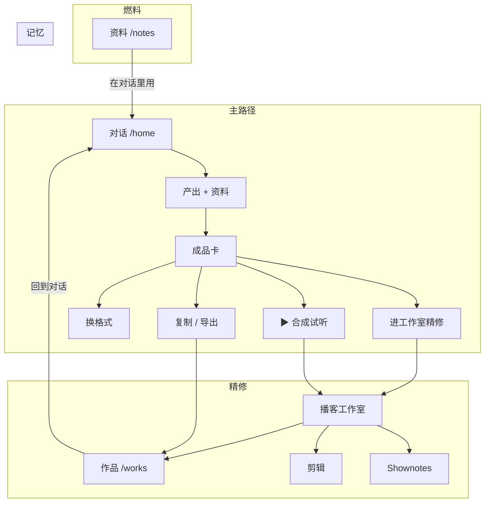

# 对话主入口 · 产品架构收口（v1.1）

> **状态**：产品规格（待评审）；**创作主入口已被 [writing-cursor-studio.md](./writing-cursor-studio.md) supersede（2026-06-04 五决策冻结）**  
> **日期**：2026-06-04  
> **关联**：[writing-cursor-studio.md](./writing-cursor-studio.md)（**现行：Studio `/studio`、创作侧栏、Work 实体**）· [home-composer-experts.md](./home-composer-experts.md) · [author-ip-product-v6.md](./author-ip-product-v6.md) · UI 参考 `HomeComposerFirstScreenDemo.tsx` · 导航 Demo [composer-first-architecture.canvas.tsx](/Users/mark/.cursor/projects/Users-mark-minimax-aipodcast/canvases/composer-first-architecture.canvas.tsx)

### Supersede 摘要（仍沿用本文 §2 资料/作品/创作工具时）

| 项 | v1.1 本文 | Studio 路线（以 writing-cursor-studio 为准） |
|----|-----------|-----------------------------------------------|
| 创作主入口 | 对话 `/home`→`/chat` | **创作 `/studio`** |
| 主实体 | 对话 turn | **Work + Manuscript** |
| 侧栏一级「话」 | 对话 | **「创」→ Studio** |
| `/chat` | 主入口 | **经典对话**，二级 |

---

## 1. 定位

### 1.1 一句话

**带着自己的资料，在对话里说一句话，拿走能发的成品；要做播客就一键试听，或送进工作室精修。**

### 1.2 四支柱

| 支柱 | 职责 | 不是什么 |
|------|------|----------|
| **对话** `/home` | 策划、生成、改稿、轻量试听 | 设置页、第二个 ChatGPT |
| **资料** `/notes` | 投料、索引、溯源 | 独立创作入口 |
| **作品** `/works` | 记忆、续做、分发资产 | 纯文件列表 |
| **创作工具** `/create` 等 | 播客/TTS/剪辑/Shownotes 精修 | 与对话并列的主入口 |

### 1.3 主打用户

| 用户 | 北极星 | 主出口 | 成功标准 |
|------|--------|--------|----------|
| **自媒体日更** | 今天能发 | 小红书 / 公号 | 复制 → 粘贴 → 发 |
| **播客主** | 本期能听、能分发 | 播客音频 + shownotes | 导出 → 上架 |
| **知识工作者** | 写得准、引得对 | 长文 / 摘要 / 提纲 | 可核对、可引用、可改 |

三类用户 **共用同一内核**（对话 + 资料 + 多格式 + 作品），差异在 **默认出口、主 CTA、速度档/可信档**。

### 1.4 完整闭环（6 段）

当前四支柱覆盖 **创作前半段**；完整产品还需后两段（P1+，不接平台 API 也可先做手动标记）：

```
资料 → 对话 → 多格式出口 → 作品记忆 → 发布追踪 → 复盘反哺
  ↑__________________________________________________|
```

---

## 2. 工作台侧栏导航（v1.1 冻结）

> 实现锚点：`AppShell.tsx` · `navPaths.ts` · `i18nDict.ts` · `NotesWorkbenchMinimalRail.tsx` · `WorksPageClient.tsx` · `notes/trash/page.tsx`

### 2.1 设计目标

| 目标 | 做法 |
|------|------|
| 一个创作主入口 | 仅「对话」为一级创作心智 |
| 燃料 / 记忆分离 | 「资料」「作品」与对话并列一级 |
| 精修工具降级 | 「创作工具」折叠组，默认收折 |
| 去掉冗余概念 | **删除「本地文稿」**；**回收站不进侧栏** |
| 低频能力页内达 | 回收站从 **作品页头** 进入 |

### 2.2 侧栏：现网 → 目标

```
现网                              目标（展开态）
────                              ────────────
话  /home                  →      对话      /home
笔  /notes（知识库）        →      资料      /notes
创作播客 /create ▾          →      作品      /works
  ├ 剪辑/shownotes/音色            ── 创作工具 ──（默认收折）
作  /works                          创作工具 ▾
本  /drafts（本地文稿）              ├ 播客工作室  /create?mode=podcast
删  /notes/trash（回收站）           ├ 语音合成    /create?mode=tts
── 作品与整理 ──                     ├ 音频剪辑    /clip
                                    ├ Shownotes   /shownotes
                                    └ 音色        /voice
──────────────
订阅 / 我的                         订阅 / 我的
```

**侧栏明确移除（不进任何分组）：**

| 移除项 | 原因 | 替代 |
|--------|------|------|
| **本地文稿** `/drafts` | 本机 localStorage，与「作品=云端记忆」冲突 | 删除功能；见 §2.6 |
| **回收站** `/notes/trash` | 低频；现路由在 `/notes` 下但含作品+资料两类删除项 | 作品页头入口；见 §2.5 |

### 2.3 展开态线框

```
┌─────────────────────────┐
│ [Logo]            [折叠] │
├─────────────────────────┤
│  对话            /home   │  ← Primary：主创作
│  资料            /notes  │  ← Primary：燃料
│  作品            /works  │  ← Primary：记忆
│                         │
│  ── 创作工具 ──          │  ← Secondary 分组标题
│  创作工具 ▾              │  ← 默认收折；在工具路由时自动展开
│      播客工作室          │
│      语音合成            │
│      音频剪辑            │
│      Shownotes          │
│      音色                │
├─────────────────────────┤
│  订阅                    │
│  我的                    │
└─────────────────────────┘
```

**折叠态窄轨（72px）**

| short | 路由 | 行为 |
|-------|------|------|
| 话 | `/home` | 直达 |
| 料 | `/notes` | 直达（现「笔」→「料」） |
| 作 | `/works` | 直达 |
| 具 | 展开工具子菜单 / 最近工具 | 无独立回收站、无 drafts icon |

### 2.4 一级 vs 二级：视觉与交互

**一级（`navCore`）— 三项**

| 项 | i18n | short | activeMatch |
|----|------|-------|-------------|
| 对话 | `nav.home` | 话 | `path === /home` |
| 资料 | `nav.notes` → **资料** | 料 | `matchesNotesWorkbench`（不含 trash） |
| 作品 | `nav.works` → **作品** | 作 | `pathMatchesRoot(/works)`（不含 trash） |

**二级（`navTools`）— 折叠组**

| 子项 | href | 高亮条件 |
|------|------|----------|
| 播客工作室 | `/create?mode=podcast` | `matchesProductStudio` 且非纯 TTS |
| 语音合成 | `/create?mode=tts` | `/tts` redirect 或 mode=tts |
| 音频剪辑 | `/clip` | `pathMatchesRoot(/clip)` |
| Shownotes | `/shownotes` | `pathMatchesRoot(/shownotes)` |
| 音色 | `/voice` | `pathMatchesRoot(/voice)` |

**父行「创作工具」**

- **推荐策略 B**：父行 = 展开/收折；**不**直接跳转（避免与「对话主入口」抢语义）。
- 在 `/create` `/clip` 等任一路由：`toolsExpanded = true`；在 `/home` `/notes` `/works`：**默认收折**。
- handoff 进入 `/create?handoff=1`：自动展开 + 「播客工作室」子项 active。

**组件**：`CreateStudioNavExpanded` → 重构为 **`StudioToolsNavExpanded`**（5 子项 + 父行收折）。

### 2.5 回收站：归入「作品」域，不进侧栏

**现网问题**：`/notes/trash` 同时展示「已删笔记 + 已删作品」，返回链却指向「← 笔记本」，与侧栏挂在「作品与整理」矛盾。

**冻结方案**

| 维度 | 决策 |
|------|------|
| 侧栏 | **无回收站项** |
| 主入口 | **作品页标题行右侧**「回收站 →」文字链 |
| 次要入口 | 资料 Hub 底部：「已删资料在回收站 →」（链到 `#notes` 段） |
| 主 Tab | **不加**第 4 个 Chip「回收站」（与 音频/文稿/进行中 并列会污染主路径） |
| 页面内容 | **保留两段**：已删作品 + 已删资料笔记（API 不变） |
| 返回链 | 「← 返回作品」（替换现「← 笔记本」） |

**作品页线框**

```
┌─────────────────────────────────────────────────────────┐
│  作品                              回收站 →              │
│  播客音频、文稿成品与进行中任务                           │
├─────────────────────────────────────────────────────────┤
│  [ 音频 ]  [ 文稿 ]  [ 进行中 (2) ]                      │
│  …列表…                                                  │
└─────────────────────────────────────────────────────────┘
```

**回收站页线框**

```
┌─────────────────────────────────────────────────────────┐
│  ← 返回作品                                              │
│  回收站                                                  │
│  已删作品与已删资料笔记；默认保留 7 天                      │
├─────────────────────────────────────────────────────────┤
│  [ 已删作品 ]  [ 已删资料 ]     ← P1 Segmented；P0 可上下两段 │
├─────────────────────────────────────────────────────────┤
│  （列表 + 批量恢复/永久删除，沿用现 notes/trash 实现）       │
└─────────────────────────────────────────────────────────┘
```

**路由迁移**

| 阶段 | 路径 |
|------|------|
| P0 | 仍用 `/notes/trash`；作品页链过去；改返回文案 |
| P1 | canonical **`/works/trash`**；`/notes/trash` → 301 |
| P1+ | 可选 `?section=works \| notes` 或 hash `#notes` |

**Badge（P2）**：作品页「回收站」旁 `(N)`，N = 已删作品 + 已删资料总数。

### 2.6 本地文稿：删除（非「并入作品 Tab」）

**现网**：`/drafts` + `podcastDrafts.ts`（localStorage）；作品 gallery「存到草稿箱」→ `/drafts`。

**冻结：功能下线，不迁移为作品 Tab。**

| 动作 | 说明 |
|------|------|
| 侧栏移除 | 删除 `nav.drafts` 项 |
| 路由 | `/drafts` → 301 `/works?tab=script` + 一次性 toast「本地文稿已下线，请使用云端作品与对话续做」 |
| 代码 | 删除或废弃 `drafts/page.tsx` 写入路径；`PodcastWorksGallery` 去掉 `insertPodcastDraftAtTop` + push `/drafts` |
| 替代 | **复制文稿** / **回到对话继续改** / 送 **语音合成**（`TTS_IMPORT_SCRIPT_KEY`） |

**与「作品 · 文稿 Tab」关系**：文稿 Tab 展示云端 `script_draft` / `social_publish_draft` Job，**不是** localStorage 草稿。

### 2.7 资料页：与导航配合

| 调整 | 说明 |
|------|------|
| 文案 | 「知识库」→「资料」 |
| 侧栏 | 无回收站、无 trash short「删」 |
| 页内 | Hub 底部次要链：「已删资料在回收站 →」→ `/works/trash#notes`（P1） |
| 对话回链 | 「在对话里用这本 →」`/home?notebook=` |

### 2.8 其他导航规则

1. **`/podcast`**：继续 redirect `/create?mode=podcast`；侧栏不单独暴露。
2. **`shouldKeepSidebarExpanded`**（`navPaths.ts`）：P1 收紧——仅资料笔记本编辑页、作品详情页保持宽轨；`/create` 不再强制与 `/notes` 同权。
3. **登录预热**（`navPrefetch.ts`）：主序列 `home → notes → works`；`create` 改为 handoff/hover 次级预热；移除 `/drafts`。
4. **`NotesWorkbenchMinimalRail`**：与主侧栏对齐——话 / 料 / 作 + 创（跳 `/create` 或展开工具）。
5. **Admin** `/admin/*`：独立 layout，本方案不涉及。

### 2.9 文案对照（i18n）

| Key | 现网 | 目标 |
|-----|------|------|
| `nav.notes` | 知识库 | **资料** |
| （新增）`nav.notesShort` | — | **料** |
| `nav.create` | 创作播客 | **创作工具** |
| `nav.createShort` | 创 | **具** |
| `nav.works` | 我的作品 | **作品** |
| `nav.library` | 作品与整理 | **删除**（改用 `nav.tools` 分组标题） |
| `nav.tools` | （新增） | 创作工具 |
| `nav.toolPodcast` | （新增） | 播客工作室 |
| `nav.toolTts` | （新增） | 语音合成 |
| `nav.trash` | 回收站 | 保留文案，**仅用于作品页内链与回收站页标题** |
| `nav.drafts` | 本地文稿 | **删除 key**（下线） |
| `works.trashLink` | （新增） | 回收站 |
| `trash.backToWorks` | （新增） | 返回作品 |

### 2.10 路由职责表（更新）

| 路由 | 角色 | 侧栏 | 用户何时来 |
|------|------|------|------------|
| `/home` | 主创作台 | 一级 | 默认 |
| `/notes` | 燃料库 | 一级 | 攒素材、索引 |
| `/works` | 记忆库 | 一级 | 找历史、续做、分享 |
| `/works/trash` | 已删记忆+已删燃料 | **无**（作品页进） | 恢复误删 |
| `/create` | 播客/TTS 精修 | 工具子项 | handoff / 老用户 |
| `/clip` `/shownotes` `/voice` | 后期 | 工具子项 | 从 job 链入 |
| `/drafts` | ~~本地文稿~~ | **删除** | redirect → works |

### 2.11 导航相关排期

**P0（与侧栏 IA 同批，约 1～2 周）**

| # | 交付 | 文件 |
|---|------|------|
| N1 | `navCore` 三段一级 + 去掉 drafts/trash | `AppShell.tsx` |
| N2 | `StudioToolsNavExpanded`（5 子项，默认收折） | `AppShell.tsx` |
| N3 | i18n 文案 | `i18nDict.ts` |
| N4 | 作品页头「回收站 →」 | `WorksPageClient.tsx` |
| N5 | 回收站返回「← 作品」 | `notes/trash/page.tsx` |
| N6 | `NotesWorkbenchMinimalRail` 对齐 | `NotesWorkbenchMinimalRail.tsx` |

**P1**

| # | 交付 |
|---|------|
| N7 | 下线 `/drafts` + gallery 存草稿改复制/回对话 |
| N8 | `/works/trash` canonical + redirect |
| N9 | 资料 Hub 次要回收站入口 |
| N10 | `shouldKeepSidebarExpanded` / prefetch 收紧 |
| N11 | 回收站页内 Segmented Tab |

**回归清单（改 AppShell 必测）**

1. 侧栏：`/home` → `/notes` → `/works` → 创作工具子项  
2. 作品页 → 回收站 → 返回作品  
3. handoff `/create?handoff=1` → 工具组展开、播客工作室高亮  
4. 窄轨 / 移动抽屉：话料作具 可点  
5. `/admin` 无 Provider 报错（unchanged）

---

## 3. 对话页 `/home`

### 3.1 首屏结构

```
┌─────────────────────────────────────────┐
│  输入框（主视觉唯一焦点）                  │
├─────────────────────────────────────────┤
│  产出 ▾ │ 资料 ▾ │ 习惯 ▾ │ 特色 ▾      │
└─────────────────────────────────────────┘
         ↓
    对话时间线（成品卡 ≠ 聊天气泡）
```

| 控件 | 心智 | 说明 |
|------|------|------|
| **产出 ▾** | 多格式出口 | 含「自由聊」；小红书 / 公号 / 口播 / 播客；记住上次 |
| **资料 ▾** | 燃料 | 仅选笔记本；展示篇数 + 索引状态 |
| **习惯 ▾** | 怎么写 | 我的习惯 / 通用客观 / 不套用 |
| **特色 ▾** | 你的脸 | 核心 3 问 + 补充字段（对齐 author-ip v6） |

**首屏不放**：专家长列表、热点助手、作品 gallery（移至 `/works`）。

### 3.2 两种模式

| 模式 | 触发 | 交互 |
|------|------|------|
| **自由聊** | 产出 = 自由聊 | 流式 Markdown |
| **任务流** | 选产出格式 / 采纳意图浮条 | 评审块（≤2 步）→ 成品卡 |

**冻结规则**（与 [home-composer-experts.md](./home-composer-experts.md) 对齐）：

- intake 期不重聊，只点选项；发送键不提交新任务。
- 改稿用 chip（更短 / 换标题 / 更口语），不重走完整 intake。
- 意图浮条 **建议不自动切换**；用户确认才进任务流。

### 3.3 成品卡模板

```
┌─ 成品卡 ─────────────────────────────────────┐
│ {出口} · 资料覆盖度 full / partial / none      │
│ ───────────────────────────────────────────── │
│ 【主体内容】                                   │
│ ───────────────────────────────────────────── │
│ 依据条（知识工作者必显；日更可折叠）              │
│ ───────────────────────────────────────────── │
│ [ 主 CTA ]  [ 换格式 ]  [ 改一版 … ]           │
└───────────────────────────────────────────────┘
```

**各 persona 主 CTA：**

| 出口 | 自媒体日更 | 播客主 | 知识工作者 |
|------|------------|--------|------------|
| 小红书 / 公号 | 复制全文 | 复制全文 | 复制 + 导出 |
| 口播 | 复制脚本 | 复制脚本 | 复制 + 依据 |
| 播客 | 换口播版 | **▶ 直接合成** / 进工作室 | 复制大纲 + 导出 MD |

### 3.4 Onboarding 三选一

首次进入对话，一步选择（可跳过）：

| 选择 | 默认产出 | 默认行为 |
|------|----------|----------|
| 我主要日更发内容 | 发小红书 | 可 skip confirm；资料计划可选 |
| 我主要做播客 | 做播客 | 主 CTA = 合成试听；形态/时长必问 |
| 我主要写资料长文 | 长文/摘要 | 强开资料计划 + 覆盖度展示 |

写入用户偏好（localStorage / 账户设置），随时在「特色」或设置中修改。

---

## 4. 资料 `/notes`

**页头定位句**：「资料是你的创作燃料，在对话里选用。」

| 调整 | 优先级 |
|------|--------|
| UI「知识库」→「资料」 | P0 |
| 笔记本/笔记详情：**「在对话里用这本 →」**（`/home?notebook=`） | P0 |
| 每篇索引状态：已就绪 / 索引中 / 失败 | P0 |
| 快投料：链接 / 粘贴 / 语音进笔记本 | P1 |
| 「被 N 次创作引用」 | P1 |
| 篇级 / smart 选取（现网整本 notebook） | P1 |

---

## 5. 作品 `/works`

**从文件列表 → 创作记忆库（含已删记忆的入口，不含侧栏回收站）。**

### 5.1 页头与 Tab

```
作品                                    回收站 →
[ 音频 ]  [ 文稿 ]  [ 进行中 ]
```

- **主 Tab 仅三个**：音频 / 文稿 / 进行中（不加回收站 Tab）。
- **回收站**：标题行右侧文字链 → `/notes/trash`（P0）→ `/works/trash`（P1）。
- **文稿 Tab**：云端 `script_draft`、`social_publish_draft` 等 Job；**不是**已下线的 localStorage「本地文稿」。

### 5.2 默认视图：按会话/系列分组（P1）

```
📅 6月4日 · 产品复盘（对话 #abc）
   源资料：产品笔记
   [ 小红书 ] [ 公号稿 ] [ 播客 ▶ ]
   [ 回到对话继续改 ]  [ 再出一版口播 ]
```

### 5.3 作品状态（发布追踪 P1+）

| 状态 | 说明 |
|------|------|
| 未发布 | 默认 |
| 已发 | 手动标记（不接平台 API） |
| 进行中 | Job 未完成；对应 Tab「进行中」 |
| 系列/期 | 播客按「第 N 期」分组 |

### 5.4 续做必须带上下文（P0）

「回到对话继续改」须恢复：

- `sessionId` + 最近 turns（memory）
- `notebook` + `noteIds`
- 上次出口格式 + 成品摘要

---

## 6. 对话 → 精修：Handoff

### 6.1 三层深度

| 层级 | 位置 | 用户动作 | 适用 |
|------|------|----------|------|
| **L1** | 对话内 | ▶ 直接合成试听 | 播客主快验证 |
| **L2** | 播客工作室 | 进工作室精修 | 调音色/双人/时长/封面 |
| **L3** | clip / shownotes / voice | 从 job 进入 | 已有音频后期 |

### 6.2 播客成品卡 CTA（P0）

```
[ ▶ 直接合成试听 ]    [ 进工作室精修 ]    [ 复制大纲 ]
```

### 6.3 Handoff 包（`ComposerHandoff` v1）

```typescript
type ComposerHandoff = {
  v: 1;
  source: "home_composer";
  sessionId: string;
  turnId: string;

  scriptText: string;
  scriptJobId?: string;       // 优先从 job 拉全文，避免 URL 过长

  notebook?: string;
  noteIds?: string[];

  outputMode?: "dialogue" | "article";
  durationHint?: "short" | "medium" | "long";

  stylePrompt?: string;
  authorIpPrompt?: string;
  programName?: string;

  returnTo: string;           // /home?session=xxx
  createdAt: number;
};
```

**传递方式（P0）**：`sessionStorage` 键 `fym_composer_handoff_v1` + URL `/create?mode=podcast&handoff=1`；读取后 **消费并清除**。

**P2**：`POST /api/composer/handoff` 短链，跨设备。

### 6.4 工作室进入态

```
← 回到对话 · {会话标题}     来自对话 · 已带入大纲与资料

[ 正文预填 ]  时长 ▾  形态 ▾  音色 ▾  封面 ▾  [ 生成播客 ]

快捷： Shownotes | 文稿剪辑 | 音色
```

**生成完成**：`/works/{jobId}?returnTo=/home?session=xxx`（回对话，非仅回 `/create`）。

### 6.5 子工具链

| 工具 | 入口 | 带入 |
|------|------|------|
| 播客工作室 | L2 handoff | Handoff 包 |
| 语音合成 | 口播要 TTS | scriptText |
| 文稿剪辑 | 试听条 / 作品 | jobId |
| Shownotes | 试听条 / 作品 | script + jobId |
| 音色 | 换声线 | 回 L2，保留 script |

---

## 7. 现网差距（2026-06 快照）

| 能力 | 现网 | 目标 |
|------|------|------|
| 播客对话出口 | `script_draft` 文本大纲 | L1 合成 + L2 handoff |
| 进工作室 | 仅文案「可进工作室补 TTS」，无按钮 | 成品卡 CTA + 预填 |
| `/create` | 只读 `?mode=` | 读 handoff 预填脚本与资料 |
| 侧栏 | 话/笔/创作/作/本/删 六项 | **对话/资料/作品** + 工具折叠；无 drafts/trash |
| 回收站 | `/notes/trash` 侧栏 + 返回笔记本 | 作品页头进入；返回作品 |
| 本地文稿 | `/drafts` 侧栏 + localStorage | **删除**；redirect works |
| 作品续做 | 打开静态资产 | 恢复 session + 资料上下文 |

---

## 8. 排期

### P0（4～6 周）— 主叙事成立

| # | 交付 | 主要触点 |
|---|------|----------|
| 1 | 对话首屏四下拉 | `HomeComposerPage` / `HomeComposerShell` |
| 2 | 成品卡与聊天气泡视觉分离 | `FormatCard` / `DeliverableCard` |
| 3 | 播客 handoff → 工作室预填 | `FormatCard` + `create/page` + `lib/composerHandoff.ts` |
| 4 | **侧栏 IA（§2.11 N1–N6）** | `AppShell` · `WorksPageClient` · trash 返回链 |
| 5 | 改稿 chip | 成品卡 |
| 6 | 资料覆盖度 + 资料计划进 confirm | 任务流 / notes RAG |
| 7 | 作品「回到对话续做」 | `/works` |
| 8 | Onboarding 三选一 | `/home` 首次 |

### P1（6～10 周）— 三类 persona 感到完整

| # | 交付 |
|---|------|
| 9 | L1 对话内播客合成 + 会话内试听条 |
| 10 | 一稿多格式（同 memory 换出口） |
| 11 | 依据可点回原文 |
| 12 | 作品按会话/系列分组 |
| 13 | 资料快投料 |
| 14 | 修订版本 v1/v2 |
| 15 | 试听条 → clip / shownotes |
| 16 | **下线本地文稿 + `/works/trash`（§2.11 N7–N11）** |

### P2 — 护城河

- 发布状态 + 手动复盘 → 反哺习惯/资料权重  
- 跨设备 handoff API  
- 平台数据回流  
- 团队协作  

### 明确不做（P1 前）

- 平台 API 直连发布  
- 侧栏恢复「创作」与「对话」并列首屏  
- 100+ 专家 / 专家中心侧栏  
- UV 预扣/展示（待 ADR）  

---

## 9. 模块映射（研发）

| 模块 | 动作 | 优先级 |
|------|------|--------|
| `HomeComposerPage` | 四下拉 + 成品卡 CTA 分叉 | P0 |
| `HomeComposerFormatCard` | 播客：合成 / 进工作室 | P0 |
| `homeComposerFormatJobs` | L1 合成 Job | P1 |
| `HomePageClient` | 默认 Composer；`?legacy=1` 保留旧首页 | P0 |
| `AppShell` | 侧栏 §2：`navCore` + `StudioToolsNavExpanded`；移除 drafts/trash | P0 |
| `create/page` + `PodcastStudio` | handoff 读取与预填 | P0 |
| `NotesPageMain` | 文案 + 「在对话里用」+ 回收站次要链 | P0/P1 |
| `WorksPageClient` | 页头回收站链 + 续做 | P0 |
| `notes/trash/page.tsx` | 返回作品；P1 迁 `/works/trash` | P0/P1 |
| `drafts/page.tsx` | **下线**；redirect | P1 |
| `PodcastWorksGallery` | 去掉 push `/drafts` | P1 |
| `navPrefetch.ts` / `navPaths.ts` | 预热与 `shouldKeepSidebarExpanded` | P0/P1 |
| `NotesWorkbenchMinimalRail` | 话/料/作/创 | P0 |
| `HomeComposerFirstScreenDemo` | P0 UI 验收基准 | 参考 |
| `home-composer-experts.md` | 与四下拉出口、handoff 对齐 | 文档 |

---

## 10. 验收标准

| Persona | 验收路径 |
|---------|----------|
| **自媒体日更** | 粘贴复盘 → 选资料 → **45s 内**复制小红书全文 |
| **播客主** | 对话出大纲 → 合成试听或 handoff 工作室 → 听到音频 → shownotes 同包 |
| **知识工作者** | 选资料 → 出稿带覆盖度 → 点依据回原文 → 改一节出 v2 |

**全局**：用户不应纠结「先去创作页还是对话页」——**永远从对话开始**。

---

## 11. 用户旅程总图



---

## 12. 修订记录

| 版本 | 日期 | 说明 |
|------|------|------|
| v1.1a | 2026-06-04 | 顶部 supersede：创作主入口改 Studio，见 writing-cursor-studio |
| v1.1 | 2026-06-04 | §2 工作台侧栏 v1.1：删除本地文稿、回收站归作品域、创作工具折叠 |
| v1.0 | 2026-06-04 | 初版：四支柱收口、三类 persona、handoff、P0/P1 排期 |
