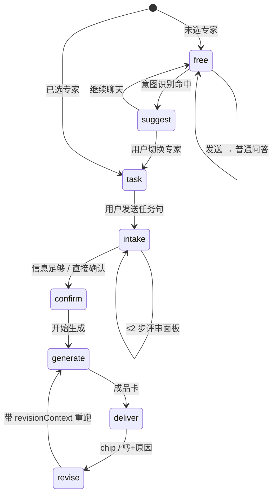
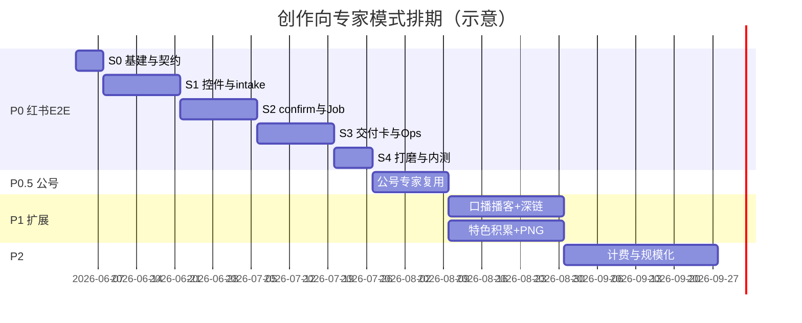

# 首页 Composer · 创作向专家模式

> 状态：**产品规格（v3.0）** — 新增 **§16 产品排期**；v2.9 交付卡 UI。  
> 交互原型：[home-composer-experts.canvas.tsx](/Users/mark/.cursor/projects/Users-mark-minimax-aipodcast/canvases/home-composer-experts.canvas.tsx)  
> UI 参考：`HomeComposerPage` + `ComposerShell`（**控件行映射**）；成品卡样式可参考 `HomeComposerFirstScreenDemo.tsx`（**非**整页布局替换）

---

## 1. 目标

在首页 Composer 提供 **创作向专家**：用户用一句话描述任务，专家澄清需求后交付 **可复制成品 + 全流程傻瓜操作包**（不只「怎么写」，还含配图、发布、互动、复盘等 **运营核心路径**）；**不选专家** 时保持现有大模型自由问答。

**两种模式**

| 模式 | 触发 | 用户感知 |
|------|------|----------|
| **自由问答** | 未选专家 + 无意图浮条被采纳 | 流式 Markdown 聊天 |
| **专家任务** | 手动选专家 **或** 用户点击意图浮条切换 | 评审 → 确认 → 进度 → 成品卡 → 反馈 |

**不采用（本版）**：Author IP `learn` 接口、专家中心侧栏、100+ 泛行业专家、专家团并行（留 backlog）。

---

## 2. 已冻结产品决策

| # | 决策 | 冻结结论 |
|---|------|----------|
| 1 | **意图识别** | 未选专家时命中创作意图 → **仅浮条建议**；**不自动**进入任务模式 |
| 2 | **intake 形态** | **最多 2 步评审面板**；多选 + 预勾选；可「按任务句直接确认」 |
| 3 | **反馈与重生成** | 快捷 chip 直接重生成；**👎** 须选原因 |
| 4 | **UI 改动边界** | 对话布局不变；**仅改** `ComposerShell` 控件行（专家/资料/写作习惯/我的特色） |
| 5 | **专家交付物** | **内容成品 + Ops 傻瓜包**（制作→发布→互动→复盘） |
| 6 | **计费 / UV** | **暂缓**；实现不阻塞于计费方案；不做 UV 预扣/展示（后续 ADR） |
| 7 | **intake 推断** | **规则推断 + 1 次轻量 LLM**（产出预勾选与是否跳过第 2 步）；P0 即采用 |
| 8 | **资料范围** | UI **仅选笔记本**，不支持单篇勾选；后端 `noteIds` = 该本 **全部已索引篇**（与现网一致） |
| 9 | **phase 持久化** | 刷新 / 切回会话：**未完成 confirm 可续**（§6.0）；`generate` 中断回 `confirm` |
| 10 | **会话 memory** | 专家推断与生成 **带 memory**（同会话最近 N 轮 QA，对齐 `homeComposerTurnsToMemoryTurns`） |
| 11 | **交付校验** | 生成结果 **JSON schema 校验**；失败 **自动重试 1 次**（同 prompt + 校验错误摘要） |
| 12 | **playbook 版本** | 每个 `deliverable` 存 **`playbookVersion`**（prompt/步骤模板版本号） |
| 13 | **个性化** | **删除「我的专家 / 配置我的专家」**；口吻只走 **我的特色** + **写作习惯 ▾** |
| 14 | **专家任务 vs 聊天** | **块驱动单 turn 任务流** + 可退出回自由问答（§6.0）；intake 期 **不以多轮闲聊代替选项** |
| 15 | **P0 切片** | **红书搭子 E2E 优先**；公号笔杆子 P0.5；口播/播客 P1 |
| 16 | **Ops 折叠** | 7 步 **全量生成**；UI 按 intake 将非关键步 **默认折叠**（§8.4） |
| 17 | **我的特色心智** | 资料=写什么，专家=工序，写作习惯=笔法，**特色=你的脸**（§4）；confirm/交付 **特色条** 可见 |
| 18 | **最小特色集 A+B** | **核心 3 问**首屏 + 现网 **9 字段**收「补充，可选」；3/3 自动 `personalEnabled`（§4.4） |
| 19 | **交付卡 UI** | **DeliverableCard** 与聊天卡片视觉分离；**假预览 P0**、封面 PNG **P1**；**禁止** 平台 iframe（§8.5） |

---

## 3. 专家定义：人设 + 方法论 + 工具链

每位 **平台专家** 由三部分组成，召唤后须在专家条中 **对用户可见**（1～2 行，可展开详情）。

| 维度 | 含义 | 示例（红书搭子） |
|------|------|------------------------|
| **人设** | 我是谁、对谁说话、底线 | 「平台原生运营顾问，擅长可复制发布的笔记包，不编造数据」 |
| **方法论** | 先问什么、再怎么做 | 「受众 → 语气与长度 → 标题策略 → 正文结构 → 话题」 |
| **工具链** | 系统实际调用的能力 | 「资料 RAG（可选）· 社媒模板 Job · 通识兜底（无资料时）」 |

### 3.1 创作向平台专家（v1 仅四类）

**命名规则**：用户可见处一律用 **口语展示名**（2～5 字、好记）；工程与 Job 映射仍用 `PlatformExpertId`，不改 API 枚举。

| ID | **口语展示名** | 人设（摘要） | 方法论（步骤） | 工具链 |
|----|----------------|--------------|--------------|--------|
| `xhs_ops` | **红书搭子** | 笔记与话题操盘手 | 受众 → 语气/长度 → 标题数 → 正文+话题 | RAG、`social_publish/xiaohongshu`、通识 |
| `mp_ops` | **公号笔杆子** | 长文与转发结构顾问 | 文体 → 结构 → 摘要/钩子 → 成稿 | RAG、`social_publish/wechat_mp`、通识 |
| `voice_gen` | **口播编剧** | 短视频口播编剧 | 时长 → 平台 → 钩子 → 分镜稿 | RAG、script draft Job、通识 |
| `podcast_plan` | **播客主理** | 节目结构与脚本策划 | 形态 → 时长 → 深度（提纲/脚本）→ 大纲 | RAG、script draft Job、通识 |

> 旧称对照（文档/代码评论，勿出现在 UI）：小红书运营专家 → 红书搭子；公众号运营专家 → 公号笔杆子；口播生成专家 → 口播编剧；播客策划专家 → 播客主理。

每专家维护：**下拉说明行**（§3.2）、**任务示例**（§3.4）、**intake 维度池**（§3.3）、**Ops 步骤模板**（§8.2）。

### 3.2 专家 ▾ 下拉项（名称 + 说明行）

每项 **两行**：第一行专家名（可选中）；第二行 **功能说明小字**（`text-xs text-muted`，≤24 字）。

| ID | 第一行（口语名） | 第二行说明（小字） |
|----|------------------|-------------------|
| — | 不选 · 自由问答 | 聊天解惑，不生成发布包 |
| `xhs_ops` | **红书搭子** | 笔记全流程：图·标题·正文·发布·互动·复盘 |
| `mp_ops` | **公号笔杆子** | 长文全流程：结构·摘要·排版·转发·留言·复盘 |
| `voice_gen` | **口播编剧** | 短视频全流程：脚本·封面·发布文案·评论·数据 |
| `podcast_plan` | **播客主理** | 节目全流程：大纲·shownotes·分发·互动·复盘 |

**已删除（v2.5）**：`我的 · {口语名}`、`配置我的专家…` — 个性化统一见 §4。

下拉 UI 示例：

```
○ 不选 · 自由问答
  聊天解惑，不生成发布包
● 红书搭子
  笔记全流程：图·标题·正文·发布·互动·复盘
…
```

- 说明行 **不可点选**；点击区域仅限第一行。
- 每项可附 **任务示例**（§3.4），点击预填输入框。

### 3.3 各专家 intake 维度池

| 专家 | 必问维度 | 可选维度 |
|------|----------|----------|
| `xhs_ops` | 受众、笔记类型（干货/故事/清单） | 语气、长度、标题数、是否带话题；**折叠用**：`assetMode`（需做图/已有图/纯文字）、`withHashtags`、`purpose`（获客/复盘）、`engagement`（要互动/ skip） |
| `mp_ops` | 文体（观点/教程/资讯） | 结构（总分/递进/QA）、摘要风格 |
| `voice_gen` | 时长、平台（抖音/视频号等） | 钩子类型、CTA、是否分镜 |
| `podcast_plan` | 形态（单人/双人）、时长 | 深度（提纲/完整脚本）、章节数 |

维度选项支持 **多选**；互斥组用 radio，其余 checkbox。每步可含「其他」inline 输入。

### 3.4 任务示例（降低首用门槛）

专家 ▾ 展开区底部 **「试试这样写」** — 每专家 **3 条**，点击 **预填输入框**（不自动发送）：

| 专家 | 示例句 |
|------|--------|
| 红书搭子 | 「把产品复盘写成可发的小红书，要 3 个标题」 / 「基于资料写清单体笔记，面向新人」 / 「口语一点，带话题 tag」 |
| 公号笔杆子 | 「写成可转发的公众号长文，带摘要」 / 「教程体，小标题清晰」 / 「观点文，开头要钩子」 |
| 口播编剧 | 「60 秒口播，抖音，开头抓人」 / 「分镜稿，结尾引导关注」 / 「把资料缩成 45 秒脚本」 |
| 播客主理 | 「3 分钟单人提纲」 / 「双人对话大纲，有观点冲突」 / 「完整脚本节选 + shownotes」 |

---

## 4. 「我的特色」与「写作习惯」

**产品定位句（对外 / 空状态 / 引导统一使用）**

> **资料是你的素材，专家是你的工序，写作习惯是你的笔法——我的特色是你的脸。**  
> 没脸，工序再对也像代写。

**v2.5 简化**：删除「我的专家」；个性化只保留 **我的特色** + **写作习惯 ▾**。

| 概念 | 入口 | 作用 |
|------|------|------|
| **我的特色** | 控件行圆形钮（§4.1） | 身份 / 经历 / 底线；跨专家、跨会话；`myFeaturePrompt` |
| **写作习惯** | **写作习惯 ▾** | 句式、结构模板；`dialogueStylePrompt` |

**注入生成**：`platformPlaybook + myFeaturePrompt? + dialogueStylePrompt? + memory + intake + 任务句 → content + ops`

**不包含** Author IP `learn` 蒸馏；👍「记住像我」为用户 **显式 opt-in** 写入（§4.6）。

### 4.1 命名与控件（冻结）

| 触点 | 规范 |
|------|------|
| 圆形钮 `title` / `aria-label` | **我的特色 · 我是谁** |
| 未填特色（核心字段见 §4.4） | **虚线圆圈**图标；statusBar：`我的特色 · 未填写` |
| 已填且 `personalEnabled` | **实心圆 + 右上角小点**；statusBar：`我的特色 · {核心摘要 6～12 字}` |
| **写作习惯 ▾** 下拉 **首行灰字**（不可选） | `管写法，不管你是谁` |
| 二者同开 statusBar 示例 | `… · 写作习惯 · 简洁分点 · 我的特色 · 产品人复盘` |

面板 `PersonalProfileCard` 顶部 **固定分工说明**（§4.2），不随专家变化。

### 4.2 与写作习惯的一句话分工（冻结）

在 **我的特色** 面板顶：

```
我的特色 — 身份、经历、底线。换专家也不变。
写作习惯 — 句式、结构。在「写作习惯 ▾」里随时换。
```

在 **写作习惯 ▾** 内首行灰字：`管写法，不管你是谁`（与 §4.1 一致）。

| | 我的特色 | 写作习惯 |
|--|----------|----------|
| 问什么 | **我是谁、读者为什么信我、绝不怎么写** | **用什么句式/结构写** |
| 变不变 | 长期稳定，跨平台 | 可按篇换模板 |
| 与 intake | 不问「身份」；已填则 intake **少问语气** | 不问结构模板 |

### 4.3 三条用户旅程（冻结）

**旅程 ① 冷启动 — 首次选任一专家（升级 §4.5）**

**旅程 ② 生成前 — confirm「特色条」**

与资料计划并列；无特色时 **⚠ 不阻断**：

```
🙋 本次会用你的特色：产品经理 · 做过 3 次 0 到 1 · 避免鸡汤
   [编辑特色]
```

未填 / 未启用：

```
⚠ 未填我的特色 · 成稿可能像「通用运营文」  [2 分钟填写]
```

**旅程 ③ 生成后 — deliver「特色运用条」**

在 **依据 Tab** 或成品 Tab 底（一行，可展开）：

```
✨ 特色：开头用了你的「复盘者」身份；避免了「绝对化承诺」
```

须来自生成 trace / 结构化 `featureUsage`（§11），**禁止**空泛「已应用你的特色」。

### 4.4 最小特色集（冻结：方案 A+B）

**A+B** = **核心 3 问**（首屏、驱动完整度）+ 现网 **9 字段**（「补充，可选」折叠，不丢数据）。

#### 核心 3 问（首屏，约 2 分钟）

| key | 面板文案 | placeholder 示例 |
|-----|----------|------------------|
| `featureCore.who` | **你是谁、常写给谁看？** | 产品经理，写给准备转产品的人 |
| `featureCore.remember` | **你希望读者记住你什么？** | 复盘真实踩坑，不灌鸡汤 |
| `featureCore.avoid` | **千万别写成什么样？** | 绝对化承诺、编造数据 |

- intake 只问 **本篇**；核心 3 问是 **长期身份**。
- `featureCoreComplete`（0～3）→ §4.1 虚线/实心、confirm ⚠、§4.5 引导。

#### 补充 9 字段（折叠「补充，可选」）

保留现 `HomeComposerPersonalProfile` 全部字段；默认折叠。展开提示：**「填了会更像你，不填也能用。」**

与 core 冲突时 **以 core 为准**；补充仅 enrich `myFeaturePrompt`。

#### prompt 合成

`myFeaturePrompt` = 核心 3 +（非空）补充 9 字段摘要（≤800 字）+（P1）`learnedTraits`

#### 老用户规则反填（P0，打开面板时）

| `featureCore` | 来源 |
|---------------|------|
| `who` | `identity`（可拼接 `currentDoing` ≤40 字） |
| `remember` | 补充区 `remember` |
| `avoid` | `values`，否则 `other` 前 80 字 |

#### `personalEnabled`

- 保留「本篇不使用特色」手动关闭。
- **`featureCoreComplete === 3`** → 自动 `personalEnabled = true`，除非曾设 `personalDisabledByUser`。

#### 面板结构

首屏：§4.2 分工说明 → **核心 3 问** → ▾ 补充 9 字段 →（P1）▾ 记住的写法 → 保存。

### 4.5 首次引导（升级，冻结）

**触发**

| 条件 | 行为 |
|------|------|
| 用户 **首次选中任一专家** 且 `featureCoreComplete < 3` 且 `fym_feature_nudge_skip_count < 3` | 展示引导条 |
| 已 `featureCoreComplete === 3` 或 `personalEnabled` + 有内容 | **不弹**，仅 confirm 特色条 |
| 跳过累计 **≥3 次** | 不再自动弹；settings/特色钮仍可进 |

**文案（通用）**

```
这篇要更像你，还是像通用模板？
[2 分钟填我的特色]  [先试试通用的]
```

**选中 `xhs_ops` 时追加半句**（同条内 secondary 小字）：

`笔记要带「你是谁」才像真人号，不是纯营销号。`

**行为**

- **[2 分钟填我的特色]**：打开面板，**聚焦核心 3 问**（§4.4），补充区默认折叠。
- **[先试试通用的]**：`skip_count++`；**不阻断**发送。
- **废弃**：仅红书 + `fym_xhs_feature_nudge_seen` 单键（v2.5）；改为 **`fym_feature_nudge_skip_count`** + 核心完整度判断。

### 4.6 👍 积累：「记住：这种开头像你」（P1 冻结交互，P0 可只做 👍 记录）

用户点 **👍** 后，**可选**二级确认（toast 或 inline，非 modal 阻断）：

```
这种开头像你吗？  [记住]  [不用]
```

| 动作 | 行为 |
|------|------|
| **[记住]** | 从成品 **首段/标题** 抽 1 条 `learnedTrait`（≤40 字）追加到 `personalFeaturePreferences.learnedTraits[]`（上限 5 条，FIFO）；下次 `myFeaturePrompt` 注入「用户偏好像这样的开头：…」 |
| **[不用]** | 仅记 `feedback: positive`，不写特色 |
| 未点 | 3s 消失，等同「不用」 |

**约束**：用户 **显式 opt-in**；不走 Author IP learn；可在特色面板「记住的写法」中 **逐条删除**。

### 4.7 存储

- **我的特色**：`featureCore`（§4.4）+ `HomeComposerPersonalProfile`（补充 9 字段）+ `personalFeaturePreferences.learnedTraits[]` + `personalDisabledByUser?`
- **写作习惯**：`styleTemplateId` / 笔记本默认
- **引导**：`fym_feature_nudge_skip_count`（localStorage）

---

## 5. 入口、意图识别与默认态

### 5.0 UI 载体与改动边界（冻结）

**原则**：用户仍处在 **同一套对话创作台**；不新增专家中心侧栏、不改成「设置页首屏」、不把 intake 挪到独立页面。

**保持不变（对话区 + 壳层）**

| 区域 | 组件 / 行为 | 说明 |
|------|-------------|------|
| 左侧 | `SessionHistorySidebar` | 会话列表、新建、删除 |
| 主区上 | 未发送首屏标题「聊想法，复制就能发」 | 居中态不变 |
| 主区中 | 对话流 `session.turns` | `UserBubble` + 助手侧内容纵向滚动 |
| 输入壳 | `ComposerShell` 圆角卡片 | 上：多行 `textarea` + 发送钮；**结构不动** |
| 助手内容载体 | 对话 turn 内嵌卡片 | 通识 `GeneralAnswerCard`；专家块见 §6（同一条对话时间线） |

**仅改动（`ComposerShell` 下方控件行 + statusBar）**

现有布局（`HomeComposerShell.tsx`）：

```
┌─ ComposerShell ─────────────────────────────┐
│  [ textarea · 消息…              ] [发送] │
│  ┌ 控件行 min-h 56px ─────────────────────┐ │
│  │ 左 formatControl  │  右 contextControls│ │
│  └────────────────────────────────────────┘ │
│  [ ComposerStatusBar · 状态摘要 ]           │
└─────────────────────────────────────────────┘
```

**v2 控件映射**（只替换控件行与 status 文案，不改 DOM 层级）：

| 现控件（左→右） | v2 控件 | 交互组件 |
|----------------|---------|----------|
| 输出格式 · 多选 checkbox | **专家 ▾** · 单选 +「不选·自由问答」 | 复用 `ComposerDropAnchor` |
| 知识库 | **资料 ▾** | **仅选笔记本**；该本全部资料参与 RAG（§7） |
| 写作风格 | **写作习惯 ▾** | 通用客观 / 笔记本风格 / 用户模板 / 不套用 |
| 个人特色 · `IconToolBtn` | **我的特色 · 我是谁** · `IconToolBtn` | 未填虚线圆 / 已填实心+点（§4.1） |

- **废弃** `prefs.formats[]` 多选；格式由 **所选专家** 隐含（一专家 → 一 Job）。
- 下拉 **向上弹出**、`COMPOSER_TOOL_H` 圆形按钮等 **沿用现有样式 token**，不新做一套 toolbar。
- `ComposerStatusBar` 文案：`专家 · 红书搭子` / `资料 · 产品笔记 · 全部` / `写作习惯 · 通用` / `我的特色 · 已启用`

**控件行布局（冻结）**

```
[ 专家 ▾ ]          [ 资料 ▾ ] [ 写作习惯 ▾ ] [ 我的特色 ]
     ↑ 左 formatControl              ↑ 右 contextControls
```

**对话流内新增块（不算改控件区，算 turn 内容）**

专家模式在 **同一 turn** 的助手侧依次渲染 `AssistantBlock`（与 `GeneralAnswerCard` 并列或替代）：

`expert_strip` → `intake_step` → `confirm`（含资料计划）→ `progress` → `deliverable`（含依据条）→ `feedback`

意图识别浮条：挂在 **控件行上方或 statusBar 下** 一行 inline，**不**占用对话主滚动区首屏。

**明确不做**

- 不把专家/资料/习惯移到输入框 **上方**
- 不用 demo 的「首屏仅 Composer + 成品预览」替换 `HomeComposerPage` 整页
- 不为专家模式单独做全屏 wizard / 分步路由页

### 5.1 入口：输入框下侧控件行（非侧栏专家中心）

```
[ 任务输入 · 多行 ]
[ 专家 ▾ ]          [ 资料 ▾ ] [ 写作习惯 ▾ ] [ 我的特色 ]
[ 状态摘要 … ]
```

| 专家 ▾ 项 | 行为 |
|-----------|------|
| 不选 · 自由问答 | `expertId = null`，普通 stream 问答 |
| 四平台专家 | 绑定专家；展示说明行 + 任务示例（§3.4）；首次选红书搭子可触发 §4.1 引导 |

- **换专家**：清空当次 `intake` 与 `taskDraft`；**保留** 我的特色 / 写作习惯 / 资料笔记本选择。

### 5.2 意图识别（未选专家时）

轻量 classifier（规则 + LLM）在用户发送前或发送后检测创作意图：

| 信号 | 示例 | 建议专家 | 浮条口语名 |
|------|------|----------|------------|
| 平台词 | 笔记、话题、种草 | `xhs_ops` | 红书搭子 |
| 长文词 | 公众号、转发、摘要 | `mp_ops` | 公号笔杆子 |
| 时长词 | 60 秒、短视频、分镜 | `voice_gen` | 口播编剧 |
| 节目词 | 播客、提纲、双人对话 | `podcast_plan` | 播客主理 |

命中后展示 **底部浮条**：「看起来要发笔记 · [换红书搭子] [继续聊天]」（按意图替换为对应口语名）。  
**不自动切换**；用户点击「切换」才绑定专家并进入任务模式。识别结果可预填专家条（人设 / 方法论 / 工具链）。

### 5.3 默认态

- **专家非必选**；未选时与现 Home Composer 自由问答一致。
- 可选记忆「上次专家」仅作下拉开项高亮，**不**自动强制任务模式。

---

## 6. 任务模式流程

### 6.0 专家任务 vs 多轮聊天（冻结交互模型）

**推荐并采用：块驱动单 turn + 可退出，而非 intake 期多轮闲聊。**

| 阶段 | 用户怎么互动 | 输入框行为 |
|------|--------------|------------|
| **自由问答** | 多轮聊天 | 正常发送 → stream 回答 |
| **intake / confirm** | 只点 **评审块内** 选项与按钮 | placeholder：`先完成上方选项，或点「改聊一下」`；发送键 **不提交新任务**（Shift+Enter 仍换行） |
| **generate** | 只看进度 | 输入框 disabled 或仅显示 busy |
| **deliver / revise** | 复制、chip、👎 | 可输入 **修订意见**（走 revise）；或 **新发任务句** 开新 turn |
| **退出任务流** | 点 **「改聊一下」** 或专家改选「不选·自由问答」 | 当前 `taskDraft` 归档折叠；回到自由问答 |

**memory（冻结）**

- intake 推断与最终生成均传入 **同会话最近 N 轮** memory（与现 `memoryTurns` 一致，建议 N=6～10）。
- memory 含：用户任务句、通识回答摘要、**上一张成品卡摘要**（title + 1 句），便于「基于刚才那版改标题」。
- **不**把 intake 选项面板本身当作多轮 chat history 逐条喂回。

**同会话混用示例**

1. 用户先自由问答问资料 → 再选红书搭子发任务句 → memory 含前文。  
2. 任务流 confirm 中点「改聊一下」→ 专家自动切「不选·自由问答」，追问一句 → 再手动选专家继续（新 taskDraft）。

### 6.0.1 Phase 持久化（刷新 / 切会话）

持久化在 **`HomeComposerSession.taskDraft`**（随 session 存 localStorage；登录用户 P1 可同步）。

```ts
type ExpertTaskDraft = {
  expertId: PlatformExpertId;
  phase: TaskPhase;
  taskSentence: string;
  intake: Record<string, string | string[]>;
  intakeStep: number;           // 当前第几步
  confirmAck?: boolean;
  turnId: string;               // 绑定的助手 turn
  updatedAt: string;
};
```

| 事件 | 行为 |
|------|------|
| **刷新页面** | 恢复 `taskDraft`；`intake`/`confirm` **原块继续可点**；`generate` 若中断 → 回 `confirm` 并提示「上次未完成，可重新开始生成」 |
| **切换会话** | 每会话独立 `taskDraft`；切回时 **可续** 未完成 confirm |
| **换专家 / 选不选** | 清空 `taskDraft` |
| **deliver 完成** | 清空 `taskDraft`；成品留在 turn 历史 |



### 6.1 需求确认：评审面板（intake）

- 触发：已选专家 + 用户发送任务句（开启/更新 `taskDraft`）。
- **推断引擎（P0）**：**规则**（关键词、专家维度池、是否已填我的特色/写作习惯）→ **1 次轻量 LLM**（JSON：`preselected`、`skipStep2`、`hints`）→ 渲染面板。
- **动态 intake**：最多 2 步；能推断则预勾选。
- **交互**：助手消息为 **内嵌评审面板**：
  - **进度**：`第 1/2 步 · 受众与目的`
  - **多选**：`☑ 面向产品新人  ☐ 面向同行`（`minSelect: 1`）
  - **方法论 hint**：`选「同行+复盘」更适合深度案例体`
  - **其他**：展开 inline 输入 → `intake.custom.{fieldId}`
- **快捷**：`按任务句推断，直接确认`（跳过剩余步，进 confirm）。

**示例（一步内多维度）**

```
┌─ 第 1/2 步 · 受众与目的 ─────────────────┐
│ ☑ 面向产品新人    ☐ 面向同行从业者        │
│ ☑ 目的是获客      ☐ 目的是复盘沉淀        │
│ [其他：___________]                       │
│ 💡 选「同行+复盘」更适合深度案例体         │
│              [下一步] [按任务句直接确认]    │
└──────────────────────────────────────────┘
```

### 6.2 确认块（confirm）

展示：

- 专家（口语名）
- 任务摘要
- 已选 intake（含多选与自定义）
- **资料计划**（§7.2）
- **特色条**（§4.3 ②）：已填展示摘要 + [编辑特色]；未填 ⚠ + [2 分钟填写]
- **工具链**（人话）：如 `你的 2 篇资料 · 红书搭子 · 资料不足处通识补充`
- CTA：**开始生成** / **改一项**（回 intake 对应步）/ **调整资料** / **改聊一下**（§6.0）

**确认前不跑**长通识流式。可选 P1：confirm 后短分析进折叠区。

### 6.3 执行（generate）

过程 **隐藏**（无 token 流）；主区仅 **里程碑进度** + 可选「展开关键步骤」。

```
┌─ 红书搭子 · 生成中 ──────────────────────┐
│ ████████░░░░  检索资料…                  │
│ ✓ 已匹配 3 篇笔记片段                    │
│ ✓ 应用你的创作习惯                       │
│ ◌ 生成内容成品与发布傻瓜包（7 步）…        │
│ [展开关键步骤]                           │
└──────────────────────────────────────────┘
```

| 层 | 用户可见 | 隐藏 |
|----|----------|------|
| 主区 | 3～5 条关键里程碑（**须含资料步骤**，§7.2） | 完整 prompt、中间 JSON |
| 折叠 | 「分析过程」：RAG 命中摘要、推断依据 | 原始 chunk 全文 |
| 失败 | 可读原因 + 重试 / 改确认项 | stack trace |
| 弱检索 | ⚠「资料关联较弱，将更多依赖通识」 | — |

进度映射真实 Job 阶段（RAG → playbook 组装 → LLM → 后处理），对齐 `homeComposerFormatJobs`；覆盖度实测值在 deliver 阶段写入 **依据条**。

### 6.4 输出（deliver）

主区 **成品卡** = **内容成品** + **全流程傻瓜包（Ops Playbook）** + 理解辅区。

| 区块 | 内容 |
|------|------|
| **内容成品** | 专家专属 UI：文案 / 脚本等可复制主内容（见 §8.1） |
| **Ops 傻瓜包** | 按 **编号步骤** 的全流程操作清单：制作→发布→互动→复盘；每步含 **做什么 / 复制块 / 时机**（§8.2） |
| **依据条** | 覆盖度 + 引用片段（§7.3） |
| **特色运用条** | 本次如何用到特色（§4.3 ③）；无特色时省略 |
| **为什么这样做** | 结构 / 钩子 / 平台习惯 + 资料 vs 通识 |
| **预期效果** | 如「适合信息流快刷；发布后 24h 重点看收藏率」 |
| **分析过程** | RAG / 推理长文 → `CollapsibleSection` 默认折叠 |

**傻瓜包 UX** — 详见 §8.3 Tab、§8.5 交付卡。

- 成品卡 **Tab**：`成品` | `发布清单` | `依据`；**默认打开「成品」**。
- **发布清单 Tab**：§8.4 intake 折叠 + checkbox + 按步复制。
- 同一 turn 内 **intake/confirm 完成后收成「已确认」一行**（§8.5），视觉重心让给交付卡。

### 6.5 反馈优化（revise）

交付卡底部：

```
这次结果：  [👍 好用]  [👎 不对味]
           [换标题] [缩短] [更口语] [自定义…]
```

| 反馈类型 | 行为 |
|----------|------|
| 👍 | 记录 `feedback: positive`；**P1** 弹出「这种开头像你吗？」→ §4.6 **记住** 写入 `learnedTraits` |
| 👎 | 弹多选原因：太 AI / 不像平台 / 事实不对 / 风格不对 / **与我的资料不符** → 再重生成 |
| 快捷 chip | **无需原因**；含 **「更贴我的材料」**（重跑检索，不重跑 intake）；其余 chip 局部修订 prompt |
| 自定义 | 文本 → 追加 `revisionContext` |

**重生成 prompt 注入示例**

```
【用户反馈】标题太硬，想要更口语
【保留】原 intake + 任务句 + 上一版成品摘要
【约束】只改标题，正文结构不变
```

P0：chip + 👍/👎（👍 暂不弹「记住」）。P1：👍「记住像我」+ `learnedTraits` 面板可删。

---

## 6.6 生成校验与重试

1. Job 输出须 parse 为 `ExpertDeliverable` JSON。  
2. **JSON schema 校验**（步数、必填字段、`copyBlocks` 等，见 §8.1）。  
3. 校验失败 → **同上下文自动重试 1 次**，user message 附加 `validationErrors` 摘要。  
4. 仍失败 → 进度块变错误态 + 「重试 / 改确认项」；**不**展示半成品卡。  
5. 成功 deliverable 写入 **`playbookVersion`**（与 repo 内 expert playbook 文件版本一致，如 `"xhs_ops@3"`）。

---

## 7. 知识库（资料 ▾）

与现有 **资料 ▾**（notebook + noteIds）对齐，复用 notes RAG / supplement（`build_notes_qa_context_with_plan`、`should_run_supplement_stage` 等）。

**定位**：知识库不是「多一个聊天开关」，而是专家开工前的 **briefing 包**——把用户笔记/访谈/复盘变成 **可检索、可引用、可标注** 的素材，由专家 playbook + Job **改写成可发布成品**。通识仅补资料未覆盖处。

```
任务句 + intake + 我的特色 / 写作习惯
              +
        知识库（事实 / 案例 / 原文依据）
              ↓
      专家 playbook + Job → 成品卡
```

| 维度 | 知识库 | 个人风格 / 习惯 |
|------|--------|-----------------|
| 决定什么 | **写什么**、依据是什么 | **怎么写**、口吻与禁区 |
| 专家模式呈现 | 内化进成品 + 依据条 | 注入 prompt，不在 UI 重复展示 |

### 7.1 覆盖度三态

生成完成后，系统须判定 **资料覆盖度**（`corpusCoverage`），并在 confirm / 进度 / 成品 **一致展示**。判定可对接现有 `qa_plan`（`plannerCoverage`、`lowConfidence`、`retrievalChunksMeta` 等）。

| 覆盖度 | 系统行为 | 对用户文案（示例） |
|--------|----------|-------------------|
| **`full`** 命中充分 | 核心论点与关键事实优先来自资料；少触发 supplement | 「本篇 mainly 来自你的资料」 |
| **`partial`** 部分命中 | 核心来自资料；背景/过渡/平台套路由通识 supplement | 「观点来自资料；解释与过渡含通识补充」 |
| **`none`** 几乎未命中 | 以通识为主；confirm 已免责 | 「资料关联较弱，建议换笔记或检查索引后重试」 |

**规则**

- `none` 时进度区须出现 ⚠，成品 **依据条** 置顶提示弱检索，**禁止** 假装全文来自资料。
- `partial` 时成品须 **分区标注** 资料段 vs 通识段（见 §7.3）。
- 三态在 **资料计划**（生成前）可 **预估值**；生成后以 **实测值** 覆盖（见 §7.2 confirm 块）。

### 7.2 资料计划（Material Plan）

**资料计划**是 confirm 块内的独立区块，在「开始生成」前完成 **预期管理**。无资料时展示 **无资料计划**（免责 + 建议勾选）。

**有资料 — confirm 展示示例**

```
📎 资料计划
· 将检索：产品笔记 · 全部 12 篇（展示前 3 篇标题…）
· 预计用于：案例细节、产品名、时间线
· 覆盖预估：partial（部分背景可能用通识）
· 资料未覆盖处：通识补充，成品中将标注

[ 调整资料 ]  [ 开始生成 ]
```

**无资料 — confirm 展示示例**

```
⚠ 未选资料 · 将按通识生成
成品可能缺少你的真实案例与数据，建议勾选资料后重试

[ 去选资料 ]  [ 仍用通识生成 ]
```

**其他触点**

| 触点 | 展示要求 |
|------|----------|
| **资料 ▾** | **仅选笔记本**（不支持单篇勾选）；文案 `资料 · {笔记本} · 全部`；未选 + hint；索引未就绪黄点 |
| **专家条 · 工具链** | 人话示例：`你的 3 篇资料 · 红书搭子 · 资料不足处通识补充`（**不用**「RAG ON」） |
| **执行进度** | 须含资料里程碑：`✓ 已匹配 3 处相关片段` / `✓ 已提取：上线时间、3 个痛点`；弱检索：`⚠ 资料关联较弱，将更多依赖通识` |
| **理解辅区 · 为什么这样写** | 显式说明资料角色，如「案例段采用访谈原话结构」；通识段须写「发布前请核实」 |

**资料计划 payload（实现参考）**

```ts
type CorpusCoverage = "full" | "partial" | "none";

type MaterialPlan = {
  notebook: string;
  noteIds: string[];              // 后端：该本全部可检索篇（UI 不展示逐篇勾选）
  noteCount: number;
  noteTitles?: string[];          // confirm 展示前 3 篇 +「等 N 篇」
  plannedUses: string[];
  coverageEstimate: CorpusCoverage;
  supplementPolicy: "on_gap";
  indexPendingCount?: number;
};
```

confirm 块 `AssistantBlock` 扩展：`{ kind: "confirm"; …; materialPlan?: MaterialPlan }`。

### 7.3 依据条（Provenance Bar）

交付卡主内容 **下方** 须有 **依据条**（默认展开一行摘要；「查看引用片段」可展开）。让用户 **可证**「专家读过哪些资料、哪段是通识」。

**折叠态（默认）**

```
📎 依据：主要来自《产品复盘》《用户访谈》；
         「7 天留存 32%」来自资料；标题策略来自通识
[ 查看引用片段 ]
```

**展开态**

- 列表：笔记标题 + 1 句命中摘要 + 「在成品中的位置」（如「正文第 2 段案例」）
- 通识贡献项：灰边 / `通识` 标签，不与资料条目混排
- 覆盖度 badge：`full` / `partial` / `none` 与 §7.1 文案一致

**各专家差异化标注**

| 专家 | 标注方式 |
|------|----------|
| `xhs_ops` | 正文句末可选 `[资料]` / `[通识]`；配图建议链到资料章节 |
| `mp_ops` | 侧栏「引用来源」；摘要若来自资料单独 badge |
| `voice_gen` | 分镜行 `来源：{笔记标题} · {片段摘要}` |
| `podcast_plan` | 章节大纲下挂「素材来源笔记」 |

**依据条 payload（实现参考）**

```ts
type ProvenanceItem =
  | {
      kind: "corpus";
      noteId: string;
      noteTitle: string;
      excerpt: string;           // 命中摘要，≤120 字
      usedIn: string;            // 在成品中的位置描述
    }
  | {
      kind: "general";
      label: string;             // 如「标题策略」「行业背景」
      usedIn: string;
    };

type ProvenanceBar = {
  coverage: CorpusCoverage;
  summaryLine: string;         // 折叠态一行摘要
  items: ProvenanceItem[];
};
```

交付卡 `DeliverableMeta` 须含 `provenance: ProvenanceBar`（见 §8.1）。

### 7.4 与自由问答 + 资料的差异

| | 自由问答 + 资料 | 专家任务 + 资料 |
|--|----------------|-----------------|
| 输出 | 流式 Markdown | 结构化成品卡 |
| 资料呈现 | 答案内引用 / 来源列表 | 内化进成品 + **依据条** |
| 用户目标 | 搞懂、追问 | 复制、发布、进工作室 |
| 通识 | 与资料混排回答 | 仅缺口 supplement，**分区标注** |

产品话术：**聊天 = 问资料、得解释；专家 = 选资料、得成品。**

### 7.5 反馈与知识库

- 👎 原因须含 **「与我的资料不符」** → 重生成时提高资料权重或建议用户调整笔记范围。
- 快捷 chip **「更贴我的材料」** → 重跑检索 query，**不重跑 intake**。
- P2：正向反馈可沉淀「常引用的笔记 / 字段偏好」（roadmap）。

### 7.6 感知禁忌

1. 只显示「已启用 RAG」— 须改为「已读取 N 篇资料」。  
2. confirm 无资料计划 — 最易引发「没读我的文件」投诉。  
3. 成品无任何来源痕迹 — 无法核实数据与案例。  
4. `none` / 弱检索仍假装全来自资料 — 须 honest + 通识标注。  
5. 把资料与「写作习惯 / 我的特色」混为一谈 — 资料 = 写什么；写作习惯/特色 = 怎么写。

---

## 8. 分类型成品 UI

原则：**对话区布局不变**（§5.0）；专家交付用 **`DeliverableCard`**，与 `GeneralAnswerCard` **视觉一眼可区分**（§8.5）。  
共用组件：`DeliverableCard`、`DeliverablePreviewFrame`、`OpsPlaybookSteps`、`CopyBlock`、`ExpertStrip`、`ConfirmPanel`、`MaterialPlanPanel`、`ProgressSteps`、`ProvenanceBar`、`FeatureUsageStrip`、`FeedbackBar`。

| 专家 | 内容成品 UI | Ops 傻瓜包（§8.2） | 分块复制 |
|------|-------------|-------------------|----------|
| `xhs_ops` | 手机框预览、标题 tab、正文、话题 pill | 7 步全流程 | 按步 / 全文 |
| `mp_ops` | 宽栏、摘要、H2 目录 | 6 步全流程 | 按步 / 全文 |
| `voice_gen` | 9:16 预览、时间轴、字数 badge | 6 步全流程 | 按步 / 脚本 |
| `podcast_plan` | 章节时间线、Host 色分 | 5 步全流程 | 按步 / 大纲 |

### 8.1 内容成品 payload（实现参考）

```ts
// 小红书 — 内容成品
type XhsCoverSpec = {
  headline: string;               // 封面大字，建议 ≤12 字
  subline?: string;               // 副标题，可选
  layout: "text_top" | "text_center" | "screenshot_plus_banner";
  palette?: { background: string; text: string };
  slides: Array<{
    role: "cover" | "inner";
    description: string;          // 拍什么 / 截什么
    onImageText?: string;         // 图上字
  }>;
};

type XhsContent = {
  titles: string[];
  body: string;
  hashtags: string[];
  cover: XhsCoverSpec;            // 做图步的结构化输出；Ops ① 引用并展开操作说明
};

// 公众号
type MpContent = {
  title: string;
  summary: string;
  bodyMarkdown: string;
};

// 口播
type VoiceContent = {
  durationHint: string;
  wordCount: number;
  scriptTimeline: string;
};

// 播客
type PodcastContent = {
  showTitle: string;
  durationHint: string;
  outline: string;
  scriptExcerpt?: string;
};

/** 全流程傻瓜包 — 所有专家交付必含 */
type OpsStepTier = "must_do" | "nice_to_have" | "after_publish";

type OpsPlaybookStep = {
  stepNo: number;
  title: string;
  objective: string;
  actions: string[];
  copyBlocks?: Array<{ label: string; text: string }>;
  timing?: string;
  metrics?: string[];
  tier: OpsStepTier;           // 由 intake 映射或 LLM 标注，§8.4
  defaultExpanded: boolean;      // UI 初始态；客户端可按 §8.4 规则覆盖
  collapsedSummary?: string;     // 折叠态一行摘要（≤40 字）
};

type OpsPlaybook = {
  expertId: PlatformExpertId;
  steps: OpsPlaybookStep[];
  recapStepNo: number;       // 指向复盘优化步编号
};

type FeatureUsage = {
  applied: boolean;
  summaryLine: string;           // deliver 特色运用条
  items?: string[];              // 展开：用了身份/避免了禁区…
};

type DeliverableMeta = {
  rationale: string[];
  expectedEffect: string;
  provenance: ProvenanceBar;
  playbookVersion: string;
  featureUsage?: FeatureUsage;
};

type PersonalFeaturePreferences = {
  learnedTraits: string[];       // 👍 记住，最多 5 条
};

type FeatureCore = {
  who: string;
  remember: string;
  avoid: string;
};

function featureCoreComplete(core: FeatureCore): number {
  return ["who", "remember", "avoid"].filter((k) => (core[k as keyof FeatureCore] || "").trim()).length;
}

type ExpertDeliverable = {
  expertId: PlatformExpertId;
  content: XhsContent | MpContent | VoiceContent | PodcastContent;
  ops: OpsPlaybook;
  meta: DeliverableMeta;
};
```

### 8.2 全流程傻瓜包（Ops Playbook）— 分专家步骤模板

专家 Job prompt 须按下列 **最小步骤集** 生成；可根据 intake 省略空步，但 **不可** 只输出正文。

#### `xhs_ops` 红书搭子（7 步）

| 步 | 标题 | 须输出 |
|----|------|--------|
| ① | **做图** | 须含 **`cover: XhsCoverSpec`**；Ops 内写清工具步骤（醒图/截图标注）；竖版 3:4；无图时纯文字封面方案 |
| ② | **标题** | 3 个标题（与 content 一致）+ 各标题 **适用场景** 一句 |
| ③ | **正文** | 可复制正文 + 段落意图（钩子/干货/CTA 各段作用） |
| ④ | **Tag** | 5-10 个话题，分 **核心 tag / 流量 tag / 精准 tag**；复制一行格式 |
| ⑤ | **发布** | 发布前 checklist（5 条内）；**建议时段**（工作日/周末 × 早中晚）；是否开 GEO、谁可见 |
| ⑥ | **互动** | **首评文案**（可复制）；3 类评论 **回复模板**（求资料/质疑/共鸣）；是否置顶首评 |
| ⑦ | **复盘** | 24h / 7d 看 **曝光、点击率、赞藏评**；什么算好/差；**下一步优化** 2-3 条（换封面/换标题/改首段等） |

#### `mp_ops` 公号笔杆子（6 步）

| 步 | 标题 | 须输出 |
|----|------|--------|
| ① | **结构与排版** | H2 清单、段落长度建议、哪里加粗/引用 |
| ② | **标题与摘要** | 标题 + 摘要（≤120 字）+ 朋友圈转发语（1 条） |
| ③ | **正文成稿** | 可复制 Markdown/HTML 思路说明 |
| ④ | **封面与转发** | 封面图 brief；转发朋友圈 **配文**；是否开留言 |
| ⑤ | **发布** | 群发 vs 发布时机；预览检查清单 |
| ⑥ | **留言与复盘** | 精选留言引导语；留言回复模板；阅读/分享/在看指标与优化动作 |

#### `voice_gen` 口播编剧（6 步）

| 步 | 标题 | 须输出 |
|----|------|--------|
| ① | **脚本与分镜** | 时间轴脚本（与 content 一致） |
| ② | **拍摄** | 景别/机位/提词器/时长控制 checklist |
| ③ | **封面与标题** | 封面帧建议 + 平台标题（2 个） |
| ④ | **发布文案** | 视频描述 + tag + @ 策略 |
| ⑤ | **评论互动** | 置顶评论、常见问题回复模板 |
| ⑥ | **数据复盘** | 3s/5s 完播、互动率；优化：钩子/时长/CTA |

#### `podcast_plan` 播客主理（5 步）

| 步 | 标题 | 须输出 |
|----|------|--------|
| ① | **节目结构** | 大纲/脚本（与 content 一致） |
| ② | **Shownotes** | 时间戳章节、链接位、一句话介绍 |
| ③ | **分发** | 各平台标题差异、封面 brief、上架 checklist |
| ④ | **发布与互动** | 发布时间；社群/评论区引流话术 |
| ⑤ | **复盘** | 完听率、订阅转化；下期选题建议 |

**生成约束**

- 每步 `actions` **3～7 条**，动词开头，可直接照着做。
- 涉及时间、数据处：资料有则用资料，无则标 `[通识建议]`。
- Ops 与 `content` **字段不重复堆砌**：正文在 content，Ops 只写 **操作与模板**。
- 进度里程碑须含：`✓ 内容成品就绪` → `✓ 生成发布傻瓜包（7 步）`。
- **tier 规则**：`must_do` 步 actions **3～7 条**；`nice_to_have` / `after_publish` 可 **2～4 条**（缩短折叠步体积）。

### 8.4 Ops 按 intake 折叠非关键步（冻结）

**原则**：JSON **仍输出专家规定的全部步骤**（红书 7 步等，schema 不减免）；通过 **tier + defaultExpanded** 控制 **发布清单 Tab** 首屏长度，避免 7 步 × 7 条 action  overwhelm。

**三档 tier**

| tier | UI 默认 | 用户感知 |
|------|---------|----------|
| **`must_do`** | **展开** | 这次任务必做 |
| **`nice_to_have`** | **折叠**（一行摘要） | 有时间再做 |
| **`after_publish`** | **折叠**，归入 **「发布后再看」** 分组 | 发完回来查 |

**折叠步 UI**

```
▸ ⑥ 互动 · 首评与回复模板已备好          [展开]
▾ ② 标题 · 3 个标题已写入成品 Tab
   … actions / copyBlocks …
   [复制本步]

── 发布后再看 ──
▸ ⑦ 复盘 · 24h 看赞藏，7d 看收藏率      [展开]
```

**tier 判定**：优先 **intake 映射表**（确定性）；LLM 仅可微调 `collapsedSummary`，**不可** 把 `must_do` 降为 `after_publish`。

#### 红书搭子 `xhs_ops`

| 步 | 默认 tier | 改为 `nice_to_have`（折叠）当 intake… | 改为 `after_publish` 当… |
|----|-----------|--------------------------------------|---------------------------|
| ① 做图 | `must_do` | `assetMode=已有图` 或 `noteType=纯文字` | — |
| ② 标题 | `must_do` | — | — |
| ③ 正文 | `must_do` | —（正文主内容在 **成品 Tab**；Ops ③ 可只保留段落意图 2～3 条） | — |
| ④ Tag | `must_do` | `withHashtags=否` | — |
| ⑤ 发布 | `must_do` | — | — |
| ⑥ 互动 | `nice_to_have` | 默认即折叠，**展开**当 `purpose=获客` 或 `engagement=要` | `purpose=复盘沉淀` 且未勾选互动 |
| ⑦ 复盘 | `after_publish` | — | **始终** |

`intake` 扩展字段（推断时可预填）：`assetMode` · `withHashtags` · `purpose` · `engagement`。

#### 公号笔杆子 `mp_ops`

| 步 | 默认 | 折叠条件 |
|----|------|----------|
| ① 结构 | `must_do` | — |
| ② 标题摘要 | `must_do` | — |
| ③ 正文 | `must_do` | — |
| ④ 封面转发 | `nice_to_have` | `style=资讯快讯` 且无转发需求 |
| ⑤ 发布 | `must_do` | — |
| ⑥ 留言复盘 | `after_publish` | ⑥ 整步进「发布后再看」 |

#### 口播编剧 / 播客主理

| 专家 | `must_do` 默认展开 | `nice_to_have` | `after_publish` |
|------|---------------------|----------------|-----------------|
| 口播 | ①脚本 ③封面标题 ④发布文案 | ②拍摄 | ⑤评论 ⑥数据复盘 |
| 播客 | ①结构 ②shownotes | ③分发 | ④发布互动 ⑤复盘 |

口播 intake `hasBroll=否` → ② 拍摄降为 `nice_to_have`。

**与 Tab 分工**

- **成品 Tab**：②③（文案/脚本/封面 JSON）— 用户复制主内容。
- **发布清单 Tab**：只展开 `must_do` + 用户手动展开的步；**不超过 4 步同时展开**（含用户展开）。

**验收**：同一 deliverable，intake 选「纯文字、不要 tag、复盘向」→ 发布清单 **默认可见 ≤4 步**，①④⑥⑦ 折叠或进「发布后再看」。

### 8.3 成品卡 Tab 与下游

**Tab（冻结）** — 每 Tab 含 **副标题**（`text-xs text-muted`）与可选 **badge**：

| Tab | 副标题 | badge 示例 | 内容 |
|-----|--------|--------------|------|
| **成品** | 复制就能用 | `3 标题` | §8.5 分专家预览 |
| **发布清单** | 照着做，别漏步 | `7 步 · 4 步待做` | Ops §8.4 + checkbox |
| **依据** | 为什么这样写 | `2 篇资料` | 顺序见 §8.5.4 |

**默认 Tab**：**成品**（勿默认发布清单）。

**做图步（红书）**：成品 Tab 内 `XhsCoverSpec` 大字 mock；发布清单 Ops ① 写操作步骤（§8.5.2）。

**下游深链（P1）**

| 专家 | 按钮 | 行为 |
|------|------|------|
| 口播编剧 | **进 TTS 工作室** | studio 路由，query 预填 `scriptTimeline` |
| 播客主理 | **进脚本工作室** | 预填 outline / scriptExcerpt |
| 红书/公号 | **存为草稿**（P2） | 写入 drafts |

**复盘步增强（P1）**：Ops 复盘步 **「粘贴后台数据，帮你解读」** → 轻量 LLM，3 条优化建议。

### 8.5 交付卡 UI 与预览策略（冻结）

**用户 3 秒心智**：「我该 **复制**（成品 Tab）还是 **照着做**（发布清单 Tab）？」

#### 8.5.1 与聊天卡片的边界

| | `GeneralAnswerCard`（自由问答） | `DeliverableCard`（专家交付） |
|--|--------------------------------|-------------------------------|
| 形态 | 流式 Markdown 气泡 | 浅底卡片 + 顶栏 + **Tab** |
| 主动作 | 阅读 / 复制全文 | **分块复制** + **按步执行** |
| 长分析 | 正文内 | **仅「依据」Tab 折叠** |

**禁止**：专家 deliver 用大段流式 Markdown 作主展示。

#### 8.5.2 单 turn 纵向结构

```
┌ ExpertStrip · 红书搭子 ─────────────┐
├ ▾ 已确认 · 受众新人 · 资料 12 篇 ──┤  ← 默认折叠一行
├ ✓ 生成完成 ────────────────────────┤  ← 2s 后弱化
├ 【DeliverableCard】 ───────────────┤  ← 主视觉
└ FeedbackBar ───────────────────────┘
```

**DeliverableCard 顶栏（冻结）**

```
红书搭子 · 刚刚          [复制全部]
─────────────────────────────────
[ 成品 | 发布清单 | 依据 ]   ← Tab + badge
```

- 宽度：对齐 `COMPOSER_CONTENT_MAX_W`；`rounded-2xl` + 轻阴影 + `bg-surface`。
- **`featureCoreComplete === 3`** 时成品 Tab 角标可选：`已用你的特色`。

#### 8.5.3 预览策略：假预览 P0，真导出 P1，禁止 iframe

| 级别 | 含义 | 阶段 |
|------|------|------|
| **假预览** | 比例正确的 **示意框** + **真实文案排版**（非另一套假文） | **P0** |
| **模板导出** | 从 `XhsCoverSpec` 渲染 **3:4 封面 PNG** | **P1** |
| **真平台预览** | iframe/嵌入小红书、微信后台 | **禁止** |

假预览须带 **一行免责**：`示意排版，以平台发布页为准`。

#### 8.5.4 分专家 · 成品 Tab

**红书搭子（P0 必做）**

```
┌ DeliverablePreviewFrame 9:16 ────┐
│ [CoverMock · headline + palette] │
│  正文前 3～5 行 + 话题 pill       │
└──────────────────────────────────┘
标题  ① ② ③  [segment 切换]
[复制标题] [复制正文] [复制全文含 tag]
```

- `CoverMock`：用 `XhsCoverSpec.headline` / `palette` / `layout`；slides 列表在框下折叠。
- 标题 segment：两行截断，模拟信息流标题长度。
- 心智句（框上小字）：`笔记在信息流里的样子（示意）`

**公号笔杆子**

- 宽栏（~677px 阅读宽）+ 摘要灰框 + H2 sticky 目录。
- `[复制标题]` `[复制摘要]` `[复制正文]`

**口播编剧**

- 9:16 框 + 时间轴静态高亮当前 hook 句；badge：`{durationHint}` · `{wordCount} 字`。
- 底栏主按钮 **进 TTS 工作室**（P1）。

**播客主理**

- 章节时间线 + Host A/B 色分（双人）；大纲可复制。

#### 8.5.5 发布清单 Tab

- 顶摘要：`必做 N 步 · 可稍后 M 步 · 发布后再看 K 步`（来自 §8.4 tier）。
- `must_do`：左侧品牌色竖线 + 默认展开；`after_publish`：**「发布后再看」** 灰底分组。
- 顶栏进度：`已完成 {checked}/{must_do}`（checkbox 本地态）。
- `copyBlocks`（首评、回复话术）：**浅黄底贴纸卡** + 一键复制。
- 每步右侧 **[复制本步]**；同时展开 **≤4 步**（§8.4）。

#### 8.5.6 依据 Tab（顺序冻结）

1. **特色运用条**（§4.3 ③）— 有特色时置顶  
2. **依据条**（§7.3）  
3. **为什么这样做**  
4. **预期效果**  
5. **分析过程** — `CollapsibleSection` 默认折叠  

confirm 的 **特色条 / 资料计划** 与依据 Tab 使用 **相同图标与措辞**（📎 资料、🙋/✨ 特色）。

#### 8.5.7 实现分期（UI）

| 阶段 | UI 范围 |
|------|---------|
| **P0** | `DeliverableCard` + 三 Tab + 红书 **9:16 假预览** + `CoverMock` + Ops 发布清单折叠/checkbox |
| **P0.5** | 公号宽栏预览 |
| **P1** | 封面 **PNG 导出**；口播/播客预览帧；TTS/脚本深链按钮 |
| **P2** | 无特色对比折叠；HTML 富文本预览（公号） |

#### 8.5.8 UI 禁忌

1. 专家 deliver 与自由问答 **同一卡片样式**。  
2. 假预览展示 **与 copy 不一致** 的文案。  
3. 默认 Tab 落在发布清单（首屏要像「任务清单」而非「聊天」）。  
4. 嵌入平台 iframe。  
5. 分析长文出现在成品 / 发布清单 Tab。

---

## 9. 普通问答 vs 任务模式

| | 普通问答 | 任务模式 |
|--|----------|----------|
| 条件 | 未选专家且未采纳意图浮条 | 已选平台专家 |
| 助手主区 | 流式全文 | 评审 → 确认 → 进度 → 成品 |
| 分析长文 | 直接展示（现状） | 仅「分析过程」折叠 |
| 生成 Job | 不自动触发 | 确认后单专家单 Job |
| 意图浮条 | 可出现，不强制切换 | — |

---

## 10. 与 WorkBuddy 的对标取舍

| WorkBuddy | 本方案 |
|-----------|--------|
| 专家中心侧栏 + 召唤 | **下拉开选** + 意图浮条建议 |
| 100+ 行业专家 | **4 类创作专家** |
| 专家团并行 | **暂不做了**（P2 roadmap） |
| 我的专家 + 知识分享 | **我的特色 + 写作习惯**；无 learn |
| 全局开启专家模式 | **非必选**，保留自由问答 |
| 开工前问卷 | **≤2 步多选评审** + hint + 预勾选 + 直接确认 |

---

## 11. 数据模型（实现参考）

```ts
type PlatformExpertId = "xhs_ops" | "mp_ops" | "voice_gen" | "podcast_plan";

/** 用户可见口语名 — 与 §3.1 一致，UI 禁止用旧称「XX运营专家」 */
const EXPERT_DISPLAY_NAMES: Record<PlatformExpertId, string> = {
  xhs_ops: "红书搭子",
  mp_ops: "公号笔杆子",
  voice_gen: "口播编剧",
  podcast_plan: "播客主理",
};

type ComposerExpertSelection =
  | { mode: "none" }
  | { mode: "platform"; expertId: PlatformExpertId };

type TaskPhase =
  | "idle"
  | "intake"
  | "confirm"
  | "generate"
  | "deliver"
  | "revise";

type ExpertTaskDraft = {
  expertId: PlatformExpertId;
  phase: TaskPhase;
  taskSentence: string;
  intake: Record<string, string | string[]>;
  intakeStep: number;
  turnId: string;
  updatedAt: string;
};

type ComposerSessionPrefs = {
  expert: ComposerExpertSelection;
  notebook: string;               // 资料：仅笔记本；noteIds 由后端填全部
  noteIds: string[];              // 运行时填充，非 UI 勾选
  personalEnabled?: boolean;
  styleTemplateId?: string | null;
  taskDraft?: ExpertTaskDraft;    // 挂 session 级，见 §6.0.1
  lastDeliverableId?: string;
  revisionFeedback?: string[];
};

type IntakeOption = {
  id: string;
  label: string;
  exclusiveGroup?: string; // 同组 radio
};

// 知识库：见 §7.1–§7.3
type CorpusCoverage = "full" | "partial" | "none";
// OpsPlaybook、ExpertDeliverable、XhsContent 等 — 定义见 §8.1、§8.2

type AssistantBlock =
  | { kind: "expert_strip"; persona: string; methodology: string; toolchain: string }
  | {
      kind: "intake_step";
      step: number;
      total: number;
      theme: string;
      fields: Array<{
        fieldId: string;
        prompt: string;
        multi: boolean;
        minSelect?: number;
        maxSelect?: number;
        options: IntakeOption[];
        allowOther?: boolean;
        hint?: string;
        preselected?: string[];
      }>;
    }
  | { kind: "profile_field"; fieldId: string; prompt: string }  // 已废弃；v2.5 删除配置我的专家
  | {
      kind: "confirm";
      summary: string;
      intake: Record<string, unknown>;
      toolchain: string[];
      materialPlan?: MaterialPlan;
      featureStrip?: { enabled: boolean; summary?: string; warning?: string };
      disclaimer?: string;
    }
  | { kind: "progress"; steps: Array<{ label: string; status: "done" | "active" | "pending" }> }
  | {
      kind: "deliverable";
      expertId: PlatformExpertId;
      content: XhsContent | MpContent | VoiceContent | PodcastContent;
      ops: OpsPlaybook;       // §8.2 全流程傻瓜包
      meta: DeliverableMeta;
    }
  | { kind: "feedback"; deliverableId: string; chips: string[] }
  | { kind: "analysis_collapsed"; content: string }
  | { kind: "intent_suggest"; expertId: PlatformExpertId; message: string };
```

---

## 12. 验收标准

1. 不选专家：普通 stream 问答，无 confirm、无 Job。  
2. **UI**：控件行含 **我的特色 · 我是谁**（虚线/实心 §4.1）、**写作习惯 ▾** 首行灰字；专家说明行。  
3. confirm 含 **特色条**（已填摘要 / 未填 ⚠）；deliver 含 **特色运用条**（有特色时）。  
4. 首次选专家引导 §4.5（非仅红书）；红书附加「真人号」半句。  
5. intake 规则+轻量 LLM；phase 持久化；memory；schema+重试。  
6. 资料仅笔记本；Ops 折叠 §8.4；红书 E2E。  
7. **特色 A+B**：面板首屏 **核心 3 问** + 折叠 **补充 9 字段**；3/3 自动启用（除非用户关过）；老用户 **规则反填** core。  
8. confirm 特色摘要来自 **featureCore**（6～12 字）。  
9. **DeliverableCard** 与 `GeneralAnswerCard` 视觉可区分；默认 Tab **成品**（§8.5）。  
10. 红书成品 Tab：**9:16 假预览** + `XhsCoverSpec` 封面大字 mock + 分块复制；带示意免责一句。  
11. 发布清单：tier 折叠 + 「发布后再看」分组 + checkbox 进度 + 按步复制（§8.5.5）。  
12. 依据 Tab 顺序：特色运用 → 依据 →  rationale → 预期 → 分析折叠（§8.5.6）。  
13. **禁止** 平台 iframe 预览。  
14. P1：👍「记住像我」+ `learnedTraits`（§4.6）。

---

## 13. 实现分期（摘要）

> 详细排期、里程碑与人力假设见 **§16**。

| 阶段 | 范围 | 目标里程碑 |
|------|------|------------|
| **P0** | 红书 E2E + DeliverableCard + Ops 折叠 + 特色 A+B | **红书搭子可内测** |
| **P0.5** | 公号笔杆子 + 6 步 Ops + 宽栏预览 | 双专家可用 |
| **P1** | PNG 导出、👍 记住、口播/播客、深链、意图浮条 | **四专家齐 + 闭环增强** |
| **P2** | 计费 ADR、草稿、专家团、封面 AI、a11y | 商业化与规模化 |

---

## 14. 修订记录

| 日期 | 说明 |
|------|------|
| 2026-06-03 | v1：冻结人设+方法论+工具链、下拉开选、我的专家×个人风格（无 Author IP learn）、任务问卷与折叠分析 |
| 2026-06-03 | v2：冻结三项产品决策；intake 改为 ≤2 步多选评审面板；意图浮条仅建议；执行里程碑进度；分类型 deliverable + rationale/预期/建议；反馈 chip vs 👎 分流；知识库与通识兜底；payload schema 与验收扩展 |
| 2026-06-03 | v2.1：§7 扩展 **资料计划**、**依据条**、**覆盖度三态**；confirm/进度/成品/反馈/数据模型/验收/P0 分期同步 |
| 2026-06-03 | v2.2：冻结 **UI 改动边界** — 保持对话模式布局，仅改 `ComposerShell` 控件行；§5.0 控件映射；验收 §12-2 |
| 2026-06-03 | v2.3：**我的特色** 控件命名；专家 ▾ **说明行**（§3.2）；交付升级为 **内容成品 + Ops 傻瓜包**（§8.2 分专家步骤）；§4 区分我的特色 vs 我的专家 |
| 2026-06-03 | v2.4：专家口语展示名 |
| 2026-06-03 | v2.5：… |
| 2026-06-03 | v2.6：§8.4 Ops 按 intake 折叠 |
| 2026-06-03 | v2.7：我的特色心智 §4.1～4.7 |
| 2026-06-03 | v2.8：§4.4 最小特色集 A+B 冻结 |
| 2026-06-03 | v2.9：§8.5 交付卡 UI 与预览 |
| 2026-06-03 | v3.0：**§16 产品排期**（S0～S4、M0～M6、泳道、砍 scope、放行指标）；§13 改为摘要 |

---

## 15. 后续可改善项（未纳入 v2.6）

| 优先级 | 项 | 说明 |
|--------|-----|------|
| P1 | **成功指标** | 复制率、Tab 切换、Ops 展开率、👍 率 |
| P1 | **依据纠错** | 「这条引用不对」→ 重跑 RAG |
| P1 | **登录态同步** | taskDraft / 我的特色 跨设备 |
| P2 | **计费 ADR** | 专家任务 UV 口径 |
| P2 | **封面 AI 生图** | `XhsCoverSpec` → image Job |
| P2 | **专家团** / **a11y** | roadmap |
| 观察 | **通识时段幻觉** | 发布/指标 UI 统一「以后台为准」 |

---

## 16. 产品排期（v1）

> 基准日期：**2026-06-03**；假设 **1 前端 + 1 后端/编排 + 0.5  prompt/产品**，双周迭代。人力不足时 **优先砍 P1 并行项**，不砍 P0 红书 E2E。

### 16.1 总览时间线



| 里程碑 | 目标日期（示意） | 交付物 | 放行标准 |
|--------|------------------|--------|----------|
| **M0** 契约冻结 | D+5 | JSON schema、playbook `xhs_ops@1`、types | schema 单测过 |
| **M1** 任务流可走 | D+19 | 控件行、intake、confirm、taskDraft | 能走到 confirm，不生成 |
| **M2** 红书可生成 | D+33 | Job + schema 重试 + 进度 | 能出 JSON deliverable |
| **M3** 红书可发布（P0） | D+47 | DeliverableCard + 7 步 Ops + 假预览 | §12 验收 1～13（除 P1 项） |
| **M4** 双专家 | D+61 | 公号笔杆子 P0.5 | 公号 6 步 Ops + 宽栏预览 |
| **M5** 四专家 | D+82 | 口播/播客 + 意图浮条 | 四专家均可 E2E |
| **M6** 体验完整（P1） | D+89 | PNG、👍记住、深链、复盘粘贴 | §4.6 + §8.5.7 P1 |

### 16.2 P0 红书搭子 E2E（约 7～8 周）

#### Sprint 0 · 基建（3～5 工作日）— M0

| 流 | 任务 | 产出 |
|----|------|------|
| 前后端 | `PlatformExpertId`、`ExpertTaskDraft`、`ExpertDeliverable` schema | 共享 types + JSON schema |
| 后端 | `xhs_ops` playbook v1、`playbookVersion` | prompt 文件 + 版本号 |
| 前端 | 废弃 `prefs.formats[]` 读写路径梳理 | 迁移清单 |
| 全员 | §12 验收条目 → 测试用例列表 | QA checklist |

**不放行**：未冻结 schema 不开 Sprint 1 生成逻辑。

#### Sprint 1 · 入口与 intake（2 周）— M1 前半

| 流 | 任务 | 依赖 |
|----|------|------|
| FE | 控件行：专家 ▾（说明行）、资料 ▾、写作习惯 ▾、我的特色 A+B 面板 | — |
| FE | `AssistantBlock`：expert_strip、intake_step UI | — |
| BE | intake：**规则 + 1 次轻量 LLM** → 预勾选 JSON | playbook |
| FE | taskDraft 持久化（§6.0.1）；换专家清空 | storage |
| FE | 块驱动：intake 期输入框 placeholder、「改聊一下」 | — |
| FE | 首次特色引导 §4.5；confirm **特色条**（可先 mock） | A+B 面板 |

**里程碑 M1**：选红书搭子 → 发任务句 → ≤2 步 intake → confirm（含资料计划 placeholder）。

#### Sprint 2 · confirm 与生成（2  week）— M2

| 流 | 任务 | 依赖 |
|----|------|------|
| BE | 资料计划 `MaterialPlan`（笔记本全部篇）；覆盖度预估 | 现 RAG |
| FE | confirm 块：资料计划 + 特色条 + CTA | M1 |
| BE | 红书 Job：memory + intake + featureCore → **ExpertDeliverable JSON** | schema |
| BE/FE | schema 校验 + **失败重试 1 次**（§6.6） | M0 schema |
| FE | progress 里程碑 UI；generate 期输入 disabled | — |

**里程碑 M2**：confirm → 生成 → 返回合法 JSON（可先简易卡片展示 JSON）。

#### Sprint 3 · 交付卡（2 周）— M3 核心

| 流 | 任务 | 依赖 |
|----|------|------|
| FE | **DeliverableCard** + Tab（成品/发布清单/依据） | M2 JSON |
| FE | 红书 **9:16 假预览** + `CoverMock`（§8.5.4） | `XhsCoverSpec` |
| FE | Ops **tier 折叠** + 「发布后再看」+ checkbox（§8.4/8.5.5） | intake 字段 |
| FE | 依据 Tab：依据条 + rationale + 预期；特色运用条 **可先静态** | provenance API |
| FE | 分块复制；ExpertStrip；已确认一行折叠 | — |
| BE | prompt 调优：7 步 Ops + cover JSON 稳定率 | 重试机制 |

**里程碑 M3（P0 放行）**：§12 项 1～13 通过；内测 5～10 人完整走通「选资料→红书→复制正文」。

#### Sprint 4 · 打磨（1  week）

| 任务 |
|------|
| 👍/👎 + 快捷 chip 重生成（不含「记住像我」） |
| 回归：侧栏导航、自由问答不受影响（§5.0 回归清单） |
| 埋点 v0：复制点击、Tab 切换、confirm 转化率 |
| bugfix + playbook `xhs_ops@2` |

### 16.3 P0.5 公号笔杆子（2 周）— M4

| 任务 | 复用 |
|------|------|
| `mp_ops` playbook + 6 步 Ops tier 表 | DeliverableCard、schema 校验、taskDraft |
| 公号 **宽栏预览** 成品 Tab（§8.5.4） | Tab 框架 |
| 验收：公号 E2E | 与红书同一套 confirm/进度/依据 |

**可并行（若 +1 FE）**：Sprint 4 期间后端先写 `mp_ops` playbook，不阻塞红书打磨。

### 16.4 P1 扩展（约 3～4 周）— M5 / M6

分两泳道，**可并行**：

**泳道 A · 专家扩面**

| 顺序 | 任务 | 工期 |
|------|------|------|
| 1 | 意图识别浮条（§5.2） | 3d |
| 2 | `voice_gen` + `podcast_plan` playbook & Job | 1.5w |
| 3 | 口播 9:16 + 播客时间线预览；**TTS/脚本深链** | 1w |

**泳道 B · 特色与闭环**

| 顺序 | 任务 | 工期 |
|------|------|------|
| 1 | deliver **特色运用条**（`featureUsage` 结构化） | 3d |
| 2 | 👍 **「记住像我」** + `learnedTraits` 面板（§4.6） | 1w |
| 3 | 红书封面 **PNG 导出**（`XhsCoverSpec` 模板渲染） | 1w |
| 4 | Ops 复盘 **「粘贴数据解读」** 轻量 LLM | 3d |
| 5 | 登录用户 prefs / taskDraft **服务端同步** | 1w |

**M5**：四专家均可生成 + 意图浮条。  
**M6**：P1 体验项齐；启动 **成功指标** 看板（§15：复制率、Tab、👍）。

### 16.5 P2 商业化与规模化（按需，约 4～6 周）

| 包 | 内容 | 前置 |
|----|------|------|
| **P2-a** | 计费/UV **ADR + 实现**（§2-6 暂缓项） | M3 后真实用量数据 |
| **P2-b** | 存草稿 / 作品库；红书/公号一键入库 | DeliverableCard 稳定 |
| **P2-c** | 封面 **AI 生图** Job | PNG 模板成熟 |
| **P2-d** | 专家团（多平台改写） | 四专家 playbook 稳定 |
| **P2-e** | a11y；通识时段 **统一免责 UI** | — |

### 16.6 依赖与关键路径

```
schema/playbook (S0)
    → intake LLM (S1)
        → confirm + MaterialPlan (S2)
            → xhs Job + 校验 (S2)
                → DeliverableCard (S3)  ← 关键路径
                    → P0.5 公号（复用卡）
                    → P1 他专家（复用卡）
```

**不可并行过早**：未 M2 前不做 DeliverableCard 精 UI；未 M3 前不扩公号/口播 playbook。

### 16.7 人力不足时的砍 scope 顺序

1. P1 意图浮条、复盘粘贴、PNG 导出  
2. P0.5 公号（整包后移）  
3. P0 Sprint 4 埋点 → 仅保留复制按钮计数  
4. **绝不先砍**：confirm、schema 重试、红书 7 步 Ops、假预览、特色 A+B confirm 条  

### 16.8 阶段放行指标（建议）

| 阶段 | 指标 | 目标 |
|------|------|------|
| P0 内测 | 任务 **完成率**（到 deliver） | ≥60% |
| P0 内测 | 成品 Tab **复制率** | ≥40% |
| P0 内测 | 👎 率 | ≤25% |
| P0.5 | 公号 vs 红书 **复用 bug** | 0 P0 bug |
| P1 | 「记住像我」使用率 / 👍 | 观察 ≥15% |
| P1 | 发布清单 Tab **打开率** | ≥30% |

---
