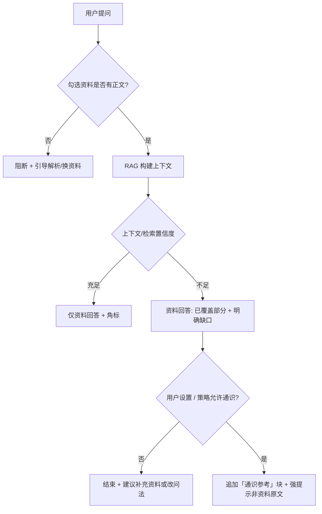

# 知识库对话：资料无命中时的「通识参考」产品方案

> 状态：**P0 / P1 已落地**（P2：输入区开关、保存剥离、敏感类策略待做）  
> 背景：用户勾选资料后提问，若向量检索几乎无片段、或正文尚未入库，当前体验多为「材料中未提及」或 `empty_context`，体感像「没有参考信息」。

## 现状（简要）

| 场景 | 当前行为 |
|------|----------|
| 勾选资料无可用正文 | 请求失败或流内 `empty_context`，提示检查解析/索引 |
| 有正文但检索分数低 | 主回答强调资料边界；命中规则时追加 **## 通识参考（非资料原文，请自行核实）**（原「补充说明」已合并改名） |
| 用户感知 | 容易理解为「系统没给任何参考」，而非「资料里没有 + 可选通识」 |

后端已有 **阶段 2 通识补充**（`notes_ask_supplement.py`），触发条件偏保守（材料缺口句式、Planner `needsSupplement` 等），**不会**在完全 `empty_context` 时发起对话。

## 产品目标

1. **有资料勾选**但检索/摘录不足时，仍尽量给出**可操作的回答**，而不是空回复。  
2. **明确区分**「来自你勾选资料」与「模型通识推断」，避免被当成 RAG 原文。  
3. **可预期、可关闭**（账号或单次），符合「资料助手」定位，控制幻觉与合规风险。

## 方案概述：三层响应

### 层 1：无正文（维持严格）

- 条件：笔记未解析、L0 为空、总字数低于门槛 → 仍 **不调用** 主问答（或仅返回引导文案）。  
- 文案示例：「当前勾选资料还没有可检索正文，请打开预览确认或等待解析完成。」  
- **不**在本层用 LLM 编造「参考信息」。

### 层 2：有正文但检索弱（核心增量）

- 条件（可组合，具体阈值交付时定）：  
  - `lowConfidence === true`；或  
  - 检索 top score &lt; T；或  
  - 送入模型的摘录总字数 &lt; N 且用户问题非纯寒暄。  
- 主回答：先按现有规则写「资料中未覆盖 X」，**禁止**把未检索到的内容写成似有据。  
- **通识参考**（新展示块，可与现有「补充说明」合并或升级文案）：  
  - 固定标题：`## 通识参考（非资料原文，请自行核实）`  
  - 正文：模型基于公开通识回答用户问题，**不得**出现 `[1][2]` 角标、不得假装引用勾选笔记。  
  - 首屏/块首一行灰字提示（产品层）：「以下内容由 AI 根据通识生成，**未**写入你的参考资料，可能与笔记本内容冲突。」

### 层 3：完全无检索片段但笔记有摘要（可选 V2）

- 若仅有笔记本综述 / 单篇 L0 摘要、无 chunk：用摘要回答能覆盖的部分，再走层 2 通识补全。  
- 需在 UI 标注「依据笔记摘要，非全文检索」。

## 触发策略（建议默认）

| 参数 | 建议默认 | 说明 |
|------|----------|------|
| 通识开关 | 开 | 环境变量或用户设置 `notes_ask_general_fallback` |
| 与补充说明关系 | 合并为一块 | 避免「补充说明」+「通识参考」两段重复 |
| 单次提问上限 | 1024 tokens | 与现有 `NOTES_ASK_SUPPLEMENT_MAX_TOKENS` 对齐 |
| 禁止场景 | 医疗/法律/投资等 | 命中敏感类问题时只给「请咨询专业人士」，不通识展开 |

## 前端展示（产品）

1. 回答区在资料正文之后、折叠区之前展示通识块；默认 **展开**，标题旁带 ⚠️ 图标。  
2. 首次在本笔记本触发时，轻提示 Toast（一次）：「本次包含通识参考，非你的资料原文。」  
3. 对话输入区旁可增加「允许通识补充」小开关（默认开）；关则仅资料模式。  
4. **不**把通识块计入「保存为笔记」的默认正文（或保存时自动 strip 该块，避免污染资料库）。

## 与「对话风格」下拉的关系

- 通识块仅受 **事实约束** system 规则约束；笔记本「提炼风格」可作用于表述语气，但须在 system 中重申：**通识块也不得虚构资料出处**。

## 风险与对策

| 风险 | 对策 |
|------|------|
| 幻觉被当成资料 | 固定标题 + 无角标 + 保存笔记剥离 |
| 与资料矛盾 | 文案要求：若通识与摘录冲突，以资料为准并一句话点明 |
| 成本 | 仅低置信触发；可配置关闭 |
| 合规 | 敏感类禁用；日志标记 `fallback_general=true` 便于审计 |

## 验收标准（产品）

1. 勾选 3 篇长文但问法极偏、检索弱：能看到资料边界说明 + 通识参考块 + 顶部/块内免责声明。  
2. 勾选未解析 PDF：仍提示等待解析，**不出现**通识块。  
3. 关闭「允许通识补充」：仅「材料中未提及」类回答，无通识块。  
4. 保存为笔记：默认不含通识块（或含明确前缀可被用户识别）。

## 实施分期（供研发排期）

- **P0**（已完成）：统一文案（`empty_context` / 低置信 preamble / 前端与 BFF 错误映射）。  
- **P1**（已完成）：扩展 `should_run_supplement_stage`（`contextChars`、检索分阈值）；标题改为「通识参考」；前端分块展示 + 免责 + 首次 Toast；保存为笔记仅存资料正文。  
- **P2**（待做）：输入区「允许通识补充」开关 + 敏感类策略。

---

*本文档仅描述产品行为，不包含接口字段与代码变更清单。*
