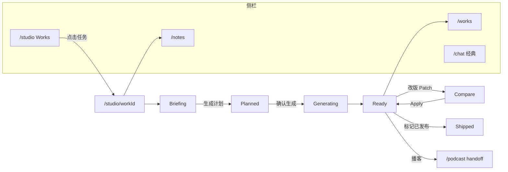

# Studio 产品线框图（Lo-Fi）

> **关联**：[writing-cursor-studio.md](./writing-cursor-studio.md) §16  
> **范围**：桌面 ≥1024px 为主；§6 移动 Tab 版  
> **状态**：产品线框 v1.0（2026-06-04）

---

## 图例

```
[按钮]  (字段)  「chip」  ▓▓▓ 主按钮   ░░░ 次按钮   ─── 分隔   ☑ 勾选   ○ 单选
│...│ 可折叠侧栏   sticky 顶栏/底栏   … 截断
```

---

## 1. `/studio` — Works 列表（创作首页）

```
┌──────────────────────────────────────────────────────────────────────────────┐
│ AppShell 侧栏 │  创作                                              [+ 新建小红书任务] ▓▓▓ │
│  创          ├──────────────────────────────────────────────────────────────┤
│  料          │  [进行中·12]  [可发布·3]  [已发布]          🔍 搜索任务…          │
│  作          ├──────────────────────────────────────────────────────────────┤
│  具          │                                                                              │
│              │  ┌────────────────────────────────────────────────────────────────────────┐  │
│              │  │ 「小红书」  Q1 产品复盘写成可发笔记              Generating ▓▓▓░░ 62%   │  │
│              │  │  资料·产品笔记(3) · v1 草稿 · Voice✓                      2 分钟前      │  │
│              │  └────────────────────────────────────────────────────────────────────────┘  │
│              │  ┌────────────────────────────────────────────────────────────────────────┐  │
│              │  │ 「小红书」  清单体教程避坑                                      待确认计划 │  │
│              │  │  资料未绑定 · 未填 Voice · 点进继续 Plan                         昨天      │  │
│              │  └────────────────────────────────────────────────────────────────────────┘  │
│              │  ┌────────────────────────────────────────────────────────────────────────┐  │
│              │  │ 「播客」    第 12 期提纲 + shownotes              可发布              3 天前 │  │
│              │  │  资料·访谈(5) · v3 · 写法✓ · 制作·双人·5min                      [续做]   │  │
│              │  └────────────────────────────────────────────────────────────────────────┘  │
│              │                                                                              │
│              │         （空状态：插图 + 「新建小红书任务」▓▓▓ + 3 条示例）                    │
│              │                                                                              │
│              ├──────────────────────────────────────────────────────────────┤
│              │  经典对话 → /chat                              已生成作品 → /works          │
└──────────────┴──────────────────────────────────────────────────────────────┘
```

**V1+ 新建下拉**：`新建` ▾ → 小红书 / 公众号 / 口播 / 播客

---

## 2. `/studio/[workId]` — 总览（桌面三栏）

```
┌────────┬─────────────────────────────────────────────────────────┬──────────────────┐
│ Corpus │  Sticky 顶栏                                             │  Agent Rail      │
│ 240px  │  ← Works   小红书·Q1复盘   planned▾  v2▾   资料3 Voice✓  │  320px           │
│        │                                    [改 Brief] [确认生成▓]│                  │
├────────┼─────────────────────────────────────────────────────────┼──────────────────┤
│ 🔍 @   │                                                          │ ┌ Plan ────────┐ │
│        │  ┌─ Plan Card ───────────────────────────────────────┐  │ │ 目标：清单体…  │ │
│ ▾ 产品 │  │ 目标：可发复盘笔记 · 受众新人                        │  │ │ 大纲 ①②③    │ │
│   笔记 │  │ 大纲：① 背景 ② 三坑 ③ 行动                           │  │ │ 资料 3 篇 ▾  │ │
│   · 3篇│  │ 资料：复盘#1 #2 #3  （缺数据已勾选兜底）              │  │ │ Voice✓      │ │
│   · 2篇│  │ Rules：Voice 已启用 · 渠道·小红书                    │  │ │ [确认生成]   │ │
│        │  │ 风险：无「待核实」事实                               │  │ └──────────────┘ │
│ 本篇将用│  │        [编辑 Brief]              [确认生成 ▓▓▓]      │ ┌ Runs ────────┐ │
│  · #1  │  └────────────────────────────────────────────────────┘  │ │ (折叠)       │ │
│  · #2  │                                                          │ └──────────────┘ │
│  · #3  │  ┌ Tab ────────────────────────────────────────────────┐ │ ┌ Chat ────────┐ │
│        │  │  [ 稿件 ● ]    [ 发布包 ]                            │ │ ▶ 展开       │ │
│        │  └────────────────────────────────────────────────────┘ │ └──────────────┘ │
│        │  （稿件 Tab 见 §3）                                       │                  │
│        │                                                          │                  │
│        │  ┌ Compare 条（有 patch 时 sticky）────────────────────┐ │                  │
│        │  │ v2 提议：2 处标题变更 · 正文无变更  [对比][采纳所选▓][放弃]│                  │
│        │  └────────────────────────────────────────────────────┘ │                  │
│        │  ┌ 改版输入 sticky bottom ─────────────────────────────┐ │                  │
│        │  │ 对 v2 改：(________________________________) [提交改版]│ │                  │
│        │  └────────────────────────────────────────────────────┘ │                  │
└────────┴─────────────────────────────────────────────────────────┴──────────────────┘
```

**左栏折叠**：仅 `│@│` 图标；hover 展开 Corpus。

**右栏折叠**：仅 `Plan` 图标条。

---

## 3. 中栏 · 稿件 Tab（小红书 channel）

```
┌─ Tab: [ 稿件 ● ]  [ 发布包 ] ─────────────────────────────────────────┐
│ 版本  [ v2 ▾ ]     [ 与 v1 对比 ]                                      │
├──────────────────────────────────────────────────────────────────────┤
│ ┌ 标题 1 ──────────────────────────────── [资料] [复制] ─────────┐ │
│ │ ☑ 复盘 3 个坑，产品人必看                                          │ │
│ └──────────────────────────────────────────────────────────────────┘ │
│ ┌ 标题 2 ─────────────────────────────────── [补充] [复制] ────────┐ │
│ │ ☑ 这次上线我学到的 3 件事                                          │ │
│ └──────────────────────────────────────────────────────────────────┘ │
│ ┌ 标题 3 ─────────────────────────────────── [待核实] [复制] ──────┐ │
│ │ ☐ 别再用错需求优先级了                                             │ │
│ └──────────────────────────────────────────────────────────────────┘ │
│ ┌ 正文 ───────────────────────────────────────────────── [复制] ─┐ │
│ │ 上线前以为功能齐=能发… [复盘#2]                                    │ │
│ │ （15px 行高，可滚动）                                              │ │
│ └──────────────────────────────────────────────────────────────────┘ │
│ ┌ 话题 ───────────────────────────────────────────────── [复制全部]┐ │
│ │ #产品复盘  #AI创作  #产品经理                                      │ │
│ └──────────────────────────────────────────────────────────────────┘ │
│ ┌ 封面说明（P0 只读）──────────────────────────────────────────────┐ │
│ │ ░░░ 假预览区 ░░░  建议：对比图 + 清单截图                         │ │
│ └──────────────────────────────────────────────────────────────────┘ │
│                                                                      │
│ [复制全部（含话题）]                              [标记已发布 ░░░]   │
└──────────────────────────────────────────────────────────────────────┘
```

---

## 4. 中栏 · Compare 模式（行内 diff）

```
┌─ Compare：v1 → v2 提议 ──────────────────────────────────────────────┐
│ [放弃]                                    [采纳所选 (2) ▓▓▓] [全部采纳] │
├──────────────────────────────────────────────────────────────────────┤
│ ▼ 标题（2 处变更）                                                    │
│ ┌ 标题 2 ──────────────────────────────────────────────────────────┐ │
│ │ ☑  v1:  这次上线我学到的 3 件事                                    │ │
│ │     v2:  上线 3 天，我踩了 3 个坑（加粗关键词）                      │ │
│ └──────────────────────────────────────────────────────────────────┘ │
│ ▶ 正文（未改动）— 点击展开                                            │
│ ▶ 话题（未改动）                                                      │
└──────────────────────────────────────────────────────────────────────┘
```

**P1 并排模式**：左列 v1（45%）| 右列 v2（45%），底栏按钮同上。

---

## 5. 中栏 · 发布包 Tab

```
┌─ Tab: [ 稿件 ]  [ 发布包 ● ] ────────────────────────────────────────┐
│ 提示：改标题后请检查「转发语」步骤                                      │
├──────────────────────────────────────────────────────────────────────┤
│ ☑ 1. 配图：按封面说明做 3 张图                          [复制要点]    │
│ ☐ 2. 发布：粘贴标题+正文+话题                           [复制正文]    │
│ ☐ 3. 首评：发引导评论一句                               [复制]        │
│ ☐ 4. 互动：回复前 5 条评论模板                          [复制]        │
│ ☐ 5. 转发：朋友圈转发语                                 [复制]        │
│ ☐ 6. 数据：24h 记录小眼睛/收藏                          [ ]          │
│ ☐ 7. 复盘：哪些标题点击高                               [ ]          │
└──────────────────────────────────────────────────────────────────────┘
```

---

## 6. 状态：`generating`

```
┌ 顶栏 ──────────────────────────────────────────────────────────────┐
│  ← Works   小红书·Q1复盘   generating…   v1▾   资料3        [取消]   │
└──────────────────────────────────────────────────────────────────────┘

中栏：稿件块只读 + 顶部细进度
┌──────────────────────────────────────────────────────────────────────┐
│ ▓▓▓▓▓▓▓▓▓▓▓▓░░░░░░░░  检索资料 ✓ · 生成标题组 … · 校验              │
└──────────────────────────────────────────────────────────────────────┘

右栏 Runs 展开：
┌ Runs ──────────────┐
│ ✓ 检索资料 (3篇)   │
│ ● 生成内容成品     │
│ ○ 生成发布包       │
└────────────────────┘

（半透明遮罩挡编辑，不挡 Runs / 取消）
```

---

## 7. 移动版 `<1024px`（Tab 切换）

```
┌─────────────────────────────┐
│ ←  Q1复盘   v2▾  generating │
├─────────────────────────────┤
│ [ 稿件 ] [ 发布包 ] [ 资料 ] [ 助手 ] │  ← 四 Tab，默认稿件
├─────────────────────────────┤
│                             │
│   （稿件 Block 列表         │
│     全宽单栏）              │
│                             │
├─────────────────────────────┤
│ 对 v2 改：…        [改版]   │  sticky
└─────────────────────────────┘

「资料」Tab = Corpus 全文
「助手」Tab = Plan + Runs + Chat 垂直堆叠
```

---

## 8. 播客 channel 增补（顶栏 + Tab）

```
Sticky 顶栏（channel=podcast）：
┌────────────────────────────────────────────────────────────────────────┐
│ ← Works  播客·第12期  ready  v3▾  资料5  [写法▾] [制作▾]  [合成试听▓] │
└────────────────────────────────────────────────────────────────────────┘

[写法▾] 下拉：
  · 我的特色（Voice）已启用 → 编辑
  · 写作习惯：笔记本风格
  · 播客人设：轻松幽默 · 双人主持

[制作▾] 下拉：（复用 PodcastStudio chip 语义）
  · 单人 / 双人 ○●
  · 音色 Speaker1 [▼]  Speaker2 [▼]
  · 时长 [3min] [5min●] [10min] 自定义
  · 语言 中文

中栏 Tab：
[ 稿件 ] [ 发布包 ] [ 试听 ● ]   ← P1；MVP 可用顶栏 [合成试听] handoff /podcast

┌ 试听 Tab ──────────────────────────────────────────────────────────────┐
│ 当前制作：双人 · 音色A + 音色B · 约 5 分钟                              │
│ 文稿版本：v3（修改文稿后需重新合成）                                    │
│                                                                        │
│         [ ▶ 合成试听 ]  → handoff 播客工作室                            │
│         [ 在工作室精修 ]  → /podcast?handoff=workId                     │
│  （P1：内嵌 30s 试听条）                                               │
└────────────────────────────────────────────────────────────────────────┘

稿件 Block 类型（替换小红书块）：
  · 节目名
  · 章节大纲（可折叠章节）
  · 脚本节选（时间轴可选 P1）
  · shownotes 节选
```

---

## 9. 与 `/chat` 对照（避免混用）

```
/chat 经典对话                         /studio 写作 IDE
─────────────────────────────────────────────────────────
  侧栏「话」                              侧栏「创」
  居中 Composer 大卡                      三栏，中栏=编辑器
  UserBubble + 助手卡流                   Block + Plan + Compare
  专家▾ 多格式▾                           单 channel（MVP 小红书）
  首屏：大标题+输入                       首屏：Works 列表
```

---

## 10. 页面流（Mermaid）



---

## 修订记录

| 版本 | 日期 | 说明 |
|------|------|------|
| v1.0 | 2026-06-04 | 初版：Works、Studio 三栏、稿件/Compare/发布包、生成态、移动、播客增补 |
