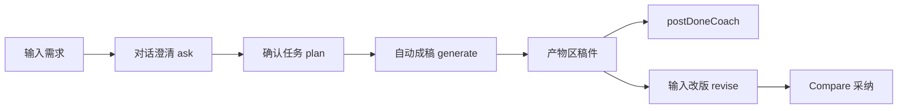

# Studio 产品线框图（Lo-Fi）

> **状态**：**历史参考 v1.0** — 实现已改为 **Agent-first**（见 [writing-cursor-studio.md](./writing-cursor-studio.md) §3.3、§16）  
> **勿按本文三栏 / 发布包 Tab / 二次确认生成 / 产物区改版输入 实施。**

---

## 图例

```
[按钮]  (字段)  「chip」  ▓▓▓ 主按钮   ─── 分隔   … 截断
```

---

## 已实现布局（ASCII，与代码一致）

### `/studio` — 列表

```
┌ AppShell ──────────────────────────────────────────────────┐
│ 创作                              [新建小红书任务] ▓▓▓      │
├────────────────────────────────────────────────────────────┤
│  （任务卡片列表：渠道 · 标题 · 状态 · 资料 · 进度）          │
├────────────────────────────────────────────────────────────┤
│  经典对话 → /chat          已生成作品 → /works               │
└────────────────────────────────────────────────────────────┘
```

### `/studio/[workId]` — Agent-first

```
┌ 任务轨 ──┬─ 主栏 max-w-3xl ────────────────────────────────┐
│ [New Agent]│  对话 · 解释                                  │
│  任务 A    │    用户气泡（可编辑）                          │
│  任务 B ●  │    助手解释（运营/澄清/附言逻辑）               │
│            ├───────────────────────────────────────────────┤
│            │  产物                                         │
│            │    「稿件」标题                                │
│            │    ┌ 标题+正文+话题 一体块 ─────────────┐     │
│            │    └────────────────────────────────────┘     │
│            │    （成稿后温和附言，无小标题）                │
│            │    [改版对比时：采纳所选 / 全部 / 放弃]        │
├────────────┼───────────────────────────────────────────────┤
│            │  [输入框………………………]  [资料▾]  [发送]          │
└────────────┴───────────────────────────────────────────────┘
```

### 主流程（Mermaid）



---

## 历史线框（v1，已废弃，仅存档）

<details>
<summary>展开：原三栏 / 发布包 / 确认执行（勿实现）</summary>

原 v1 描述：左 Corpus `@`、中稿件 Tab+发布包、右 Plan/Chat；`planned` 时置顶 Plan Card 且须 **确认生成**；`ready` 时产物区 **改版输入条**、**标记已发布**。

上述交互已由 v2 取代：资料下拉、自动成稿、底栏改版、无发布包 Tab、无标记已发布。

</details>

---

## 修订记录

| 版本 | 日期 | 说明 |
|------|------|------|
| v2.0 | 2026-06-04 | 顶部改为已实现 Agent-first；v1 三栏折叠为历史 |
| v1.0 | 2026-06-04 | 初版三栏线框 |
